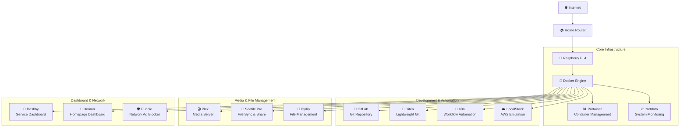

# 🏠 Home Server Lab

[](https://opensource.org/licenses/MIT)
[](https://docs.docker.com/compose/)
[](https://github.com/awesome-selfhosted/awesome-selfhosted)
[](https://www.raspberrypi.org/)

> **A comprehensive collection of self-hosted services for your home lab, optimized for Raspberry Pi and other single-board computers.**

Transform your home network into a powerful, privacy-focused digital ecosystem with enterprise-grade services running on your own hardware. This repository provides battle-tested Docker configurations for essential self-hosted applications.

## 🎯 **Project Philosophy**

- **Privacy First**: Keep your data under your control
- **Production Ready**: Enterprise-grade configurations optimized for home use  
- **Resource Efficient**: Designed for single-board computers like Raspberry Pi
- **Easy Deployment**: One-command setup with comprehensive documentation
- **Security Focused**: Secure defaults with optional hardening guides

## 🏗️ **Architecture Overview**



## 🚀 **Available Services**

### 📊 **Infrastructure & Monitoring**

| Service | Purpose | Key Features | Resource Usage |
|---------|---------|--------------|----------------|
| [**Portainer**](./portainer/) | Container Management | Web UI for Docker, stack deployment, monitoring | ~100MB RAM |
| [**Netdata**](./netdata/) | System Monitoring | Real-time metrics, alerts, performance tracking | ~250MB RAM |

### 🛠️ **Development & DevOps**

| Service | Purpose | Key Features | Resource Usage |
|---------|---------|--------------|----------------|
| [**GitLab**](./gitlab/) | Full DevOps Platform | Git repos, CI/CD, issue tracking, wikis | ~2GB RAM |
| [**Gitea**](./gitea/) | Lightweight Git Service | Git hosting, pull requests, lightweight alternative | ~200MB RAM |
| [**n8n**](./n8n/) | Workflow Automation | Visual workflow builder, API integrations | ~300MB RAM |
| [**LocalStack**](./localstack/) | AWS Cloud Emulation | Local AWS services for development & testing | ~500MB RAM |

### 📁 **File Management & Collaboration**

| Service | Purpose | Key Features | Resource Usage |
|---------|---------|--------------|----------------|
| [**Seafile Pro**](./seafile/) | Enterprise File Sync | Real-time collaboration, document editing, sync clients | ~1GB RAM |
| [**Pydio**](./pydio/) | File Management Platform | Web-based file manager, sharing, team collaboration | ~400MB RAM |

### 🎬 **Media & Entertainment**

| Service | Purpose | Key Features | Resource Usage |
|---------|---------|--------------|----------------|
| [**Plex**](./plex/) | Media Server | Stream movies, TV shows, music, transcoding | ~1GB RAM |

### 🏡 **Dashboard & Network Services**

| Service | Purpose | Key Features | Resource Usage |
|---------|---------|--------------|----------------|
| [**Dashby**](./dashby/) | Service Dashboard | Modern dashboard, service status, quick access | ~150MB RAM |
| [**Homarr**](./homarr/) | Homepage Dashboard | Customizable homepage, service integration | ~200MB RAM |
| [**Pi-hole**](./pihole/) | Network Ad Blocker | DNS-level ad blocking, network-wide protection | ~100MB RAM |

## 🚀 **Quick Start**

### Prerequisites

- **Hardware**: Raspberry Pi 4 (4GB+ RAM recommended) or any Linux server
- **OS**: Ubuntu 20.04+ / Raspberry Pi OS / Any Docker-compatible Linux
- **Software**: Docker & Docker Compose installed

### 1. Clone Repository

```bash
git clone https://github.com/Thre4dripper/Home-Server-Lab.git
cd Home-Server-Lab
```

### 2. Choose Your Services

Each service is self-contained with its own configuration:

```bash
# Deploy individual services
cd netdata && ./setup.sh    # System monitoring
cd ../portainer && ./setup.sh    # Container management  
cd ../seafile && ./setup.sh      # File collaboration
```

### 3. Access Your Services

After deployment, access services via your server IP:

- **Portainer**: http://your-server-ip:9000
- **Netdata**: http://your-server-ip:19999
- **Seafile**: http://your-server-ip:8000
- **And more...** (check individual service documentation)

## 📋 **System Requirements**

### Minimum Configuration
- **RAM**: 4GB (recommended 8GB+)
- **Storage**: 32GB+ SD card/SSD
- **Network**: Ethernet connection recommended
- **Power**: 3A+ power supply for Raspberry Pi

### Resource Planning

| Configuration | Services | Total RAM | Storage |
|---------------|----------|-----------|---------|
| **Basic** | Portainer + Netdata + Pi-hole | ~500MB | 16GB |
| **Developer** | + GitLab + n8n + LocalStack | ~3GB | 32GB |
| **Media Hub** | + Plex + Seafile + Dashboards | ~5GB | 64GB+ |
| **Full Stack** | All Services | ~8GB+ | 128GB+ |

## 🛡️ **Security & Best Practices**

### Built-in Security Features

- **Environment Isolation**: Each service runs in isolated containers
- **Secret Management**: Sensitive data in `.env` files (git-ignored)
- **Network Segmentation**: Internal Docker networks for service communication
- **Resource Limits**: Memory and CPU constraints prevent resource exhaustion
- **Health Checks**: Automatic service health monitoring and recovery

### Recommended Security Measures

1. **Change Default Passwords**: Update all default credentials
2. **Enable Firewall**: Configure UFW or iptables
3. **Use Strong Authentication**: Enable 2FA where available
4. **Regular Updates**: Keep containers and host system updated
5. **Backup Strategy**: Implement automated backups
6. **Reverse Proxy**: Use Nginx/Traefik for HTTPS termination

## 🔧 **Management Commands**

### Global Operations

```bash
# Check all running services
docker ps

# View resource usage
docker stats

# Update all services
find . -name "docker-compose.yml" -execdir docker compose pull \;
find . -name "docker-compose.yml" -execdir docker compose up -d \;

# Backup all data
tar -czf homelab-backup-$(date +%Y%m%d).tar.gz */data/ */.env

# System cleanup
docker system prune -f
docker volume prune -f
```

### Service-Specific Operations

Each service includes standardized management scripts:

```bash
cd <service-directory>
./setup.sh          # Initial deployment
docker compose logs -f   # View logs
docker compose restart  # Restart service
docker compose down     # Stop service
```

## 📊 **Monitoring & Maintenance**

### Health Monitoring

- **Netdata Dashboard**: Real-time system metrics at http://your-server-ip:19999
- **Portainer**: Container status and resource usage
- **Service Health Checks**: Built-in Docker health monitoring
- **Log Aggregation**: Centralized logging via Docker

### Maintenance Schedule

| Task | Frequency | Command |
|------|-----------|---------|
| **Check Service Health** | Daily | `docker ps` |
| **Review Logs** | Weekly | `docker compose logs` |
| **Update Containers** | Monthly | `docker compose pull && docker compose up -d` |
| **System Backup** | Weekly | Custom backup scripts |
| **Clean Docker Cache** | Monthly | `docker system prune` |

## 🤝 **Contributing**

We welcome contributions! Please see our [Contributing Guidelines](./CONTRIBUTING.md) for details on:

- Adding new services
- Improving existing configurations
- Reporting bugs and feature requests
- Documentation improvements

## 📜 **Code of Conduct**

This project adheres to a [Code of Conduct](./CODE_OF_CONDUCT.md) to ensure a welcoming environment for all contributors.

## 📚 **Documentation Structure**

Each service includes comprehensive documentation:

```
service-name/
├── README.md              # Service-specific guide
├── docker-compose.yml     # Container configuration
├── .env.example          # Configuration template
├── setup.sh              # Automated deployment
├── .gitignore            # Exclude sensitive data
└── data/                 # Persistent data (bind mounted)
```

## 🔗 **Useful Links**

### Official Documentation
- [Docker Documentation](https://docs.docker.com/)
- [Docker Compose Reference](https://docs.docker.com/compose/)
- [Raspberry Pi Documentation](https://www.raspberrypi.org/documentation/)

### Community Resources
- [Awesome Self-Hosted](https://github.com/awesome-selfhosted/awesome-selfhosted)
- [r/selfhosted](https://reddit.com/r/selfhosted)
- [Home Lab Community](https://www.reddit.com/r/homelab/)

### Security Resources
- [Docker Security Best Practices](https://docs.docker.com/engine/security/)
- [Self-Hosted Security Guide](https://github.com/imthenachoman/How-To-Secure-A-Linux-Server)

## 📄 **License**

This project is licensed under the MIT License - see the [LICENSE](./LICENSE) file for details.

## 🙏 **Acknowledgments**

- Thanks to the open-source community for creating amazing self-hosted solutions
- Special recognition to developers of each service for their excellent work
- Raspberry Pi Foundation for making affordable computing accessible
- Docker team for revolutionizing application deployment

---

<div align="center">

**[⭐ Star this repository](https://github.com/Thre4dripper/Home-Server-Lab) if you find it useful!**

[](https://github.com/Thre4dripper/Home-Server-Lab/stargazers)
[](https://github.com/Thre4dripper/Home-Server-Lab/network/members)

*Building the future of self-hosted home labs, one container at a time.*

</div>