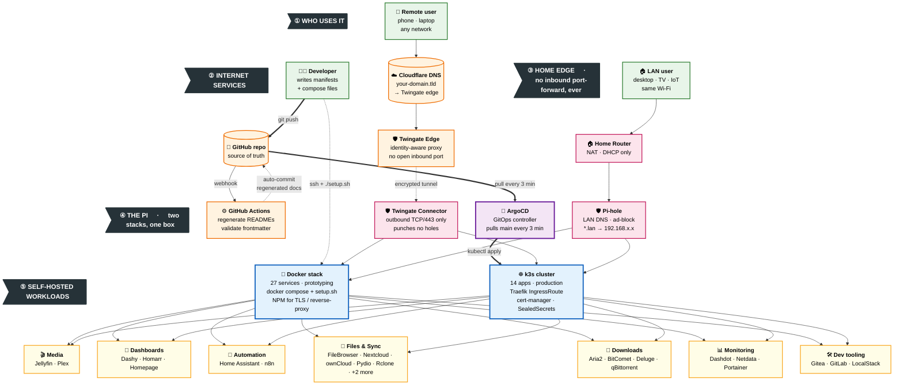

<div align="center">

# 🏠 Home Server Lab

### **Two ways to run a real homelab on a single server.**
### **🐳 Docker for prototyping. ☸️ k3s + ArgoCD for production.**

*A complete, opinionated, two-stack homelab — DNS · ad-blocking · media · torrents · smart home · automation · dashboards · file sharing · zero-trust remote access — all self-hosted, all in one repo, designed for any Linux server.*

---

[](https://opensource.org/licenses/MIT)
[](https://docs.docker.com/build/building/multi-platform/)
[](https://github.com/awesome-selfhosted/awesome-selfhosted)
[](./CONTRIBUTING.md)

[](./docker/README.md)
[](./k3s/README.md)
[](https://argo-cd.readthedocs.io/)
[](https://traefik.io/)
[](https://github.com/bitnami-labs/sealed-secrets)
[](https://www.twingate.com/)

[](https://github.com/Thre4dripper/Home-Server-Lab/stargazers)
[](https://github.com/Thre4dripper/Home-Server-Lab/network/members)
[](https://github.com/Thre4dripper/Home-Server-Lab/commits/main)

[**🐳 Docker Stack →**](./docker/README.md) ⋅ [**☸️ k3s Stack →**](./k3s/README.md) ⋅ [**⚙️ Ansible →**](./ansible/README.md) ⋅ [**🤝 Contributing →**](./CONTRIBUTING.md)

</div>

---

## 🎯 Why this repo exists

Most homelab projects pick a side: either "here's my `docker-compose.yml` collection" **or** "here's my Helm-charted k3s cluster". This repo refuses to choose, because **both have a place in a serious homelab**:

- **Docker Compose** is unbeatable for *trying things out* — clone, edit env vars, `docker compose up`. Done in ninety seconds.
- **Kubernetes (k3s)** is unbeatable for *running things long-term* — declarative state, GitOps reconciliation, sealed secrets, real ingress, real RBAC.

So this repo gives you both, side-by-side, with the **same set of services modelled twice** — once the easy way, once the production way. Pick a service, prototype it in `docker/`, then promote the working configuration to `k3s/` once you trust it.

Every choice is benchmarked for an **8 GB homelab server** (tested on Raspberry Pi 5, x86_64 mini-PCs, and cloud VMs). Everything is reproducible from a clean `git clone`. Nothing depends on a SaaS, a paid plan, or an undocumented click in someone's WebUI.

---

## ⚖️ The two stacks at a glance

| | **🐳 [Docker Stack](./docker/README.md)** | **☸️ [k3s Stack](./k3s/README.md)** |
|---|---|---|
| **Best for** | Prototyping · single-service experiments · learning · "let me try X for an evening" | Production · GitOps · long-running workloads · multi-service composition |
| **Deploy unit** | `docker compose up -d` per service | `kubectl apply -k` per app, then ArgoCD reconciles |
| **Source of truth** | `docker-compose.yml` + `.env` files | YAML manifests + SealedSecrets in git |
| **Networking** | Bridge networks + host port bindings | Traefik IngressRoute + LoadBalancer (klipper-lb) |
| **TLS / certificates** | Manual (or Nginx Proxy Manager UI) | cert-manager + Let's Encrypt, automatic renewal |
| **Secrets** | `.env` files (git-ignored) | SealedSecrets (encrypted, **safe to commit**) |
| **Updates** | `docker compose pull && up -d` | `git push` → ArgoCD auto-syncs |
| **Rollback** | Edit compose / re-pull old tag | `git revert` → ArgoCD un-applies |
| **Recovery** | Re-run `setup.sh`, restore bind mounts | `cluster-restore.sh` + PVCs |
| **Per-service docs** | <!-- AUTOGEN:DOCKER_COUNT -->27<!-- /AUTOGEN:DOCKER_COUNT --> self-contained READMEs | <!-- AUTOGEN:K3S_COUNT -->14<!-- /AUTOGEN:K3S_COUNT --> self-contained READMEs |
| **Resource overhead** | Just Docker daemon (~50 MB RAM) | k3s control plane (~500 MB RAM) |
| **Service count** | **<!-- AUTOGEN:DOCKER_COUNT -->27<!-- /AUTOGEN:DOCKER_COUNT -->** | **<!-- AUTOGEN:K3S_COUNT -->14<!-- /AUTOGEN:K3S_COUNT -->** (and growing) |

> **TL;DR** — Use the Docker stack to try things out. Promote what works to the k3s stack and let ArgoCD run it for you. They share the same Pi, the same Pi-hole DNS, and the same Twingate connector.

---

## 🏗️ Architecture at a glance

The big picture: **two deployment paths** (manual `compose up` / GitOps), **two ingress paths** (LAN via Pi-hole DNS / WAN via Twingate or Cloudflare), and **one Pi** running everything. No port-forwarding, no SaaS in the critical path.

<!-- AUTOGEN:GLOBAL_DIAGRAM -->

```mermaid
graph TB
    %% ─── HEADERS (rendered as banner nodes) ─────────────────────────────
    H1>"<b>① WHO USES IT</b>"]
    H2>"<b>② INTERNET SERVICES</b>"]
    H3>"<b>③ HOME EDGE</b>     ·     no inbound port-forward, ever"]
    H4>"<b>④ THE PI</b>     ·     two stacks, one box"]
    H5>"<b>⑤ SELF-HOSTED WORKLOADS</b>"]

    %% ─── TIER 1 · users ─────────────────────────────────────────────────
    Dev[👨‍💻 <b>Developer</b><br/>writes manifests<br/>+ compose files]
    Remote[📱 <b>Remote user</b><br/>phone · laptop<br/>any network]
    LAN[🏠 <b>LAN user</b><br/>desktop · TV · IoT<br/>same Wi-Fi]

    %% ─── TIER 2 · internet services ─────────────────────────────────────
    Repo[(🐙 <b>GitHub repo</b><br/>source of truth)]
    Actions[⚙️ <b>GitHub Actions</b><br/>regenerate READMEs<br/>validate frontmatter]
    CF[(☁️ <b>Cloudflare DNS</b><br/>your-domain.tld<br/>→ Twingate edge)]
    TGEdge[🛡️ <b>Twingate Edge</b><br/>identity-aware proxy<br/>no open inbound port]

    %% ─── TIER 3 · home edge ─────────────────────────────────────────────
    Router[🏠 <b>Home Router</b><br/>NAT · DHCP only]
    TGConn[🛡️ <b>Twingate Connector</b><br/>outbound TCP/443 only<br/>punches no holes]
    Pihole[🛡️ <b>Pi-hole</b><br/>LAN DNS · ad-block<br/>*.lan → 192.168.x.x]

    %% ─── TIER 4 · the Pi ────────────────────────────────────────────────
    Docker[🐳 <b>Docker stack</b><br/>27 services · prototyping<br/>docker compose + setup.sh<br/>NPM for TLS / reverse-proxy]
    Argo[🚀 <b>ArgoCD</b><br/>GitOps controller<br/>pulls main every 3 min]
    K3s[☸️ <b>k3s cluster</b><br/>14 apps · production<br/>Traefik IngressRoute<br/>cert-manager · SealedSecrets]


    %% ─── TIER 5 · self-hosted workloads (auto-generated) ────────────────
    W1[🎬 <b>Media</b><br/>Jellyfin · Plex]
    W2[🏡 <b>Dashboards</b><br/>Dashy · Homarr · Homepage]
    W3[🤖 <b>Automation</b><br/>Home Assistant · n8n]
    W4[📁 <b>Files &amp; Sync</b><br/>FileBrowser · Nextcloud · ownCloud · Pydio · Rclone · +2 more]
    W5[🧲 <b>Downloads</b><br/>Aria2 · BitComet · Deluge · qBittorrent]
    W6[📊 <b>Monitoring</b><br/>Dashdot · Netdata · Portainer]
    W7[🛠️ <b>Dev tooling</b><br/>Gitea · GitLab · LocalStack]

    %% ─── HEADER ANCHORS (invisible) ─────────────────────────────────────
    H1 ~~~ Dev
    H2 ~~~ Repo
    H3 ~~~ Router
    H4 ~~~ Docker
    H5 ~~~ W1

    %% ─── FLOWS · GitOps lane (purple, thick) ────────────────────────────
    Dev      == "git push" ==> Repo
    Repo     -- webhook --> Actions
    Actions -. "auto-commit<br/>regenerated docs" .-> Repo
    Repo     == "pull every 3 min" ==> Argo
    Argo     == "kubectl apply" ==> K3s

    %% ─── FLOWS · manual Docker deploy ───────────────────────────────────
    Dev -. "ssh + ./setup.sh" .-> Docker

    %% ─── FLOWS · remote access lane (orange) ────────────────────────────
    Remote --> CF --> TGEdge
    TGEdge -. "encrypted tunnel" .-> TGConn
    TGConn --> Docker
    TGConn --> K3s

    %% ─── FLOWS · LAN access lane (green) ────────────────────────────────
    LAN --> Router --> Pihole
    Pihole --> Docker
    Pihole --> K3s

    %% ─── FLOWS · stacks → workloads ─────────────────────────────────────
    Docker --> W1 & W2 & W3 & W4 & W5 & W6 & W7
    K3s    --> W1 & W2 & W3 & W4 & W5 & W6 & W7

    %% ─── STYLES ─────────────────────────────────────────────────────────
    classDef header   fill:#263238,stroke:#263238,color:#ffffff,font-size:18px,font-weight:bold
    classDef user     fill:#e8f5e9,stroke:#2e7d32,stroke-width:2px,color:#000
    classDef internet fill:#fff3e0,stroke:#ef6c00,stroke-width:2px,color:#000
    classDef edge     fill:#fce4ec,stroke:#c2185b,stroke-width:2px,color:#000
    classDef stack    fill:#e3f2fd,stroke:#1565c0,stroke-width:3px,color:#000
    classDef gitops   fill:#f3e5f5,stroke:#6a1b9a,stroke-width:3px,color:#000
    classDef workload fill:#fffde7,stroke:#f9a825,stroke-width:2px,color:#000

    class H1,H2,H3,H4,H5 header
    class Dev,Remote,LAN user
    class Repo,Actions,CF,TGEdge internet
    class Router,TGConn,Pihole edge
    class Docker,K3s stack
    class Argo gitops
    class W1,W2,W3,W4,W5,W6,W7 workload
```

**How to read this diagram:**

| Path | Color | What flows |
|------|-------|------------|
| **🟣 GitOps** (purple, thick) | `Dev → GitHub → ArgoCD → k3s` | A `git push` reconciles into the cluster automatically — no SSH, no `kubectl` |
| **🟠 Remote access** (orange) | `Remote → Cloudflare → Twingate edge ⇢ Twingate connector → stack` | Identity-aware, outbound-only, works behind CGNAT |
| **🟢 LAN access** (green) | `LAN → Pi-hole → stack` | Pure-DNS routing — no router config, no certs needed for `*.lan` |
| **🔵 The Pi** (blue) | hosts both stacks side-by-side | Docker for tinkering, k3s for production — same workloads, different lifecycles |

<!-- /AUTOGEN:GLOBAL_DIAGRAM -->

A single server sits behind a normal home router. **No port forwarding** is required — remote access flows through the Twingate connector, while the LAN gets DNS-level ad blocking and an internal `*.home.your-domain.tld` domain served by Traefik (k3s) or Nginx Proxy Manager (Docker).

> 📖 **New to all this?** Jump to **[🌐 DNS & TLS — beginner to pro](#-dns--tls--beginner-to-pro)** for a step-by-step walkthrough of *how* to actually point a hostname at your server: from `/etc/hosts` on a single laptop, to LAN-wide Pi-hole, to a real Cloudflare A-record pointing at a private IP, to mkcert and finally Let's Encrypt with the DNS-01 challenge.

---

## 🚀 Quick start

### Option A — "I just want to try one service" (🐳 Docker)

```bash
git clone https://github.com/Thre4dripper/Home-Server-Lab.git
cd Home-Server-Lab/docker/<service>     # e.g. docker/jellyfin
./setup.sh
```

Every Docker service is a self-contained folder with `docker-compose.yml`, `setup.sh` and a per-service `README.md`. The setup script handles env-file scaffolding, directory creation and `docker compose up -d`. → see **[docker/README.md](./docker/README.md)** for the full catalog and detailed walkthrough.

### Option B — "I'm running this for real" (☸️ k3s + ArgoCD)

```bash
# 1. Install k3s (single-node, with default Traefik + klipper-lb)
curl -sfL https://get.k3s.io | sh -

# 2. Bootstrap the cluster
git clone https://github.com/Thre4dripper/Home-Server-Lab.git
cd Home-Server-Lab/k3s
kubectl apply -f base/namespaces/
kubectl apply -k infra/sealed-secrets/
kubectl apply -k infra/traefik/
kubectl apply -k infra/cert-manager/
kubectl apply -k infra/argocd/

# 3. Hand the keys to ArgoCD (one ApplicationSet → one Application per app)
kubectl apply -f infra/argocd/root-app.yaml

# Done. From here, every commit to k3s/apps/** is auto-deployed.
```

→ see **[k3s/README.md](./k3s/README.md)** for the full bootstrap order, secrets workflow and service catalog.

### Option C — "Provision the bare-metal Pi too" (⚙️ Ansible)

```bash
cd Home-Server-Lab/ansible
ansible-playbook -i inventory.yml site.yml
```

Installs Docker, k3s, the Sealed Secrets controller and friends on a fresh Pi — then you're ready for Option A or B.

---

## 📚 Service catalogs

Both stacks publish auto-generated catalog pages with mermaid diagrams and per-category tables:

<!-- AUTOGEN:CATALOG_TABLE -->
| Stack | Catalog | Services | Categories |
|-------|---------|----------|------------|
| 🐳 Docker | **[docker/README.md →](./docker/README.md)** | 27 ready-to-run Compose stacks | 7 |
| ☸️ k3s | **[k3s/README.md →](./k3s/README.md)** | 14 GitOps-managed Kubernetes apps | 8 |
<!-- /AUTOGEN:CATALOG_TABLE -->

Both pages **regenerate automatically** from per-service `README.md` frontmatter via GitHub Actions — see [Automation](#-automation).

---

## 🎯 Project philosophy

- **🔒 Privacy first** — Your data, your hardware, your rules. No SaaS dependencies, no telemetry, no third-party clouds in the critical path.
- **🏗️ Production-grade patterns** — Real ingress, real secrets management, real GitOps — *even on a Pi*. The k3s stack is structured exactly the way you'd structure a small production cluster.
- **📦 Resource-efficient** — Every service has a benchmarked RAM/CPU footprint. The full Docker catalog runs comfortably on an 8 GB server (single-board, mini-PC, or VM).
- **🧪 Reproducible from zero** — `git clone` → bootstrap → working homelab. No undocumented manual clicks. No "oh, you also need to…".
- **📖 Self-documenting** — Every service carries machine-readable YAML frontmatter. The catalog pages, mermaid diagrams and category tables are derived from that frontmatter, so they cannot drift out of sync with reality.
- **🎓 Educational** — Each per-service README is structured to teach: *Why this service · How it's wired · What can go wrong · How to fix it.*

---

## 🛠️ Tech stack

<div align="center">


</div>

| Layer | Docker stack | k3s stack |
|-------|--------------|-----------|
| **Container runtime** | Docker Engine | containerd (via k3s) |
| **Orchestration** | docker compose | k3s (Kubernetes 1.28+) |
| **Ingress / proxy** | Nginx Proxy Manager (`nginx-ui`) | Traefik (built into k3s) |
| **Load balancer** | host port bindings | klipper-lb (built into k3s) |
| **TLS** | Manual / Let's Encrypt via NPM | cert-manager + Let's Encrypt |
| **Secrets** | `.env` files (git-ignored) | Bitnami SealedSecrets (encrypted in git) |
| **Deployment automation** | per-service `setup.sh` | per-app `setup.sh` + ArgoCD |
| **Remote access** | Twingate connector container | Twingate connector Pod |
| **DNS** | Pi-hole container | Pi-hole Pod (`hostNetwork: true`) |
| **CI** | GitHub Actions (README + frontmatter) | GitHub Actions (README + frontmatter) |

---

## 💻 System requirements

The reference deployment is an **8 GB homelab server with SSD storage** running Debian 12 / Ubuntu 22.04+ (64-bit). Tested on Raspberry Pi 5, Intel NUC, and Hetzner cloud VMs.

| Component | Minimum | Recommended | Notes |
|-----------|---------|-------------|-------|
| **CPU** | Quad-core 1.5 GHz (ARM64 or x86_64) | 4-core 2.0 GHz+ | Both stacks are multi-arch where underlying images support it |
| **RAM** | 4 GB | 8 GB | k3s adds ~500 MB baseline; full Docker catalog needs 6 GB+ |
| **Storage** | 32 GB | 256 GB+ NVMe / SSD | SSD strongly recommended — move `/var/lib/{docker,rancher}` for best I/O |
| **Network** | 100 Mbit Ethernet | Gigabit Ethernet | Wired strongly recommended for Home Assistant / multicast discovery |
| **Power** | Stable power supply | UPS recommended | Sudden power loss can corrupt Docker overlays / k3s etcd |

### Resource planning by use case

| Profile | Services | Total RAM | Storage | Stack |
|---------|----------|-----------|---------|-------|
| **Minimal** | Pi-hole + Portainer + Homepage | ~400 MB | 16 GB | 🐳 Docker |
| **Media hub** | + Jellyfin + qBittorrent + FileBrowser | ~2 GB | 256 GB+ | 🐳 Docker |
| **Smart home** | + Home Assistant + n8n + Mosquitto | ~3 GB | 32 GB | 🐳 Docker |
| **Production cluster** | k3s + Traefik + ArgoCD + 8–10 apps | ~4 GB | 128 GB+ | ☸️ k3s |
| **Full lab** | Both stacks side-by-side | ~6–7 GB | 256 GB+ | 🐳 + ☸️ |

---

## 🌐 DNS & TLS — beginner to pro

> *"How do I get `https://jellyfin.home` to actually work in my browser?"* — every homelab tutorial skips this. Here is the full progression, from a five-minute hack on one laptop, all the way to publicly-trusted certificates on a wildcard domain that resolves to a private IP.

Each level builds on the last. **You don't need the next level until the current one starts hurting.** Pick the lowest one that still covers your needs.

### 🥚 Level 0 — Raw IP + port (the "it just works" baseline)

```
http://192.168.1.42:8096      → Jellyfin
http://192.168.1.42:9000      → Portainer
```

- ✅ Zero setup. Works on day one.
- ❌ Ugly URLs, no TLS, no friendly names, breaks if DHCP changes the IP.
- 👍 **Use when:** you're testing a service for an hour and never coming back.

> Reserve the Pi's IP in your router's DHCP leases — it costs nothing and stops every URL from breaking the day your router reboots.

---

### 🐣 Level 1 — `/etc/hosts` (one device, no infra)

Edit `/etc/hosts` (Linux/macOS) or `C:\Windows\System32\drivers\etc\hosts` (Windows):

```
192.168.1.42   jellyfin.lan portainer.lan homepage.lan
```

Now `http://jellyfin.lan:8096` works **on that one machine**.

- ✅ Zero infra, instant.
- ❌ Per-device. Doesn't help your phone, your TV, or guests.
- 👍 **Use when:** you're the only user and you only care about your laptop.

---

### 🐥 Level 2 — Pi-hole local DNS (LAN-wide friendly names)

Run [`docker/pihole`](./docker/pihole/) (or [`k3s/apps/pihole`](./k3s/apps/pihole/)), then point your **router's DHCP** at the server's IP as the network DNS server. Now every device on your LAN — phone, TV, IoT, guests — resolves the names you define.

In `dns-entries.conf` (already wired into the Pi-hole compose file):

```
192.168.1.42  jellyfin.lan
192.168.1.42  portainer.lan
192.168.1.42  *.home.lan
```

- ✅ Whole LAN, including phones and TVs. Plus network-wide ad blocking as a bonus.
- ❌ Still no TLS — browsers will scream `Not Secure` and disable half their features (clipboard, service workers, mic/camera).
- ❌ Doesn't work outside your house.
- 👍 **Use when:** you have multiple devices and don't yet care about HTTPS.

---

### 🐤 Level 3 — Cloudflare DNS pointing at a private IP (the homelab trick)

Most people think "Cloudflare DNS" means "exposed to the internet." It doesn't have to. **DNS is just name → IP resolution; it doesn't care if the IP is public or private.** This is the single most useful trick in homelabbing.

In your Cloudflare dashboard for `your-domain.tld`:

```
Type   Name                Content          Proxy
A      home                192.168.1.42     ☁️  DNS only (grey cloud)
A      *.home              192.168.1.42     ☁️  DNS only (grey cloud)
```

Yes — a public DNS record pointing at `192.168.1.42`. From the public internet that IP is unroutable, so the record is harmless. **From inside your LAN, however, the name resolves and traffic stays local.** Result: you get a real, properly-delegated domain (`jellyfin.home.your-domain.tld`) that works on every device on your LAN — *without* editing hosts files, *without* running Pi-hole local DNS overrides, and crucially **the same hostnames will keep working for the TLS-via-Let's-Encrypt step below**.

- ✅ Real domain, no per-device config, no internal DNS server needed.
- ✅ Sets you up perfectly for Level 5 (Let's Encrypt DNS-01).
- ❌ Anyone with a Cloudflare account can see that you have a host called `jellyfin.home.your-domain.tld` pointing at an RFC-1918 IP. (Fine — it's a private IP, they can't reach it.)
- ❌ Outside your LAN the names resolve to a useless private IP. You still need Twingate / WireGuard / etc. for actual remote access.
- 👍 **Use when:** you own a domain and want professional-looking hostnames without running a DNS server.

> 🧠 **Why this is brilliant:** it makes "remote access" and "local access" use the *exact same hostname*. From your couch, `jellyfin.home.your-domain.tld` resolves to `192.168.1.42` and goes direct. From a coffee shop with Twingate connected, the resolver returns the same IP and Twingate transparently tunnels you to the LAN. One URL, two paths, zero config drift.

---

### 🐔 Level 4 — TLS with mkcert (locally-trusted HTTPS)

Now you have nice names, but browsers still complain. The cheapest fix is [`mkcert`](https://github.com/FiloSottile/mkcert) — it generates a local certificate authority and installs it into your OS trust store. Certs signed by it are trusted **on the machines where you ran `mkcert -install`**.

```bash
# On the server, once
mkcert -install
mkcert "*.home.your-domain.tld" home.your-domain.tld
# → home.your-domain.tld+1.pem  +  home.your-domain.tld+1-key.pem
```

Drop those files into Nginx Proxy Manager (Docker stack) or into a Kubernetes `Secret` consumed by Traefik (k3s stack). Browsers on machines that trust the mkcert root CA now show the green padlock.

- ✅ Real HTTPS, real green padlock, full Web-API access (clipboard, service workers, WebRTC).
- ✅ Free, offline, works for any hostname including `*.lan`.
- ❌ You must install the mkcert root CA on every device that should trust the cert. Doable for laptops, painful for Smart TVs, IoT devices and visitors' phones.
- 👍 **Use when:** you want HTTPS for *yourself* and don't want to wrestle with public certificate authorities yet.

---

### 🦅 Level 5 — Let's Encrypt with DNS-01 challenge (publicly trusted, no port forward)

The grown-up version. cert-manager (k3s) or Nginx Proxy Manager (Docker) requests a real Let's Encrypt certificate for `*.home.your-domain.tld` using the **DNS-01** challenge — Let's Encrypt asks you to prove ownership of the domain by adding a TXT record, cert-manager calls Cloudflare's API to add it, Let's Encrypt verifies, certificate issued.

**The killer feature:** because DNS-01 doesn't require Let's Encrypt to *connect* to your service, it works perfectly when:

- The hostname resolves to a private IP (Level 3 setup) ✅
- You have no port forwarding ✅
- You're behind CGNAT ✅
- You want a wildcard cert (HTTP-01 doesn't support wildcards) ✅

In k3s, this is one ClusterIssuer and one Certificate resource — see [`k3s/infra/cert-manager`](./k3s/infra/cert-manager/). In Docker, it's the "Let's Encrypt" tab in Nginx Proxy Manager with the Cloudflare DNS provider plugin.

```yaml
# k3s ClusterIssuer (excerpt)
spec:
  acme:
    server: https://acme-v02.api.letsencrypt.org/directory
    solvers:
      - dns01:
          cloudflare:
            apiTokenSecretRef:
              name: cloudflare-api-token
              key:  api-token
```

- ✅ Real, publicly-trusted certs. Works on every device, every browser, every visitor's phone, no manual trust install.
- ✅ Auto-renews every 60 days. Set and forget.
- ✅ Combined with Level 3, your `https://jellyfin.home.your-domain.tld` URL is identical from your couch, your phone over Twingate, and a friend's laptop you handed access to.
- ❌ Requires a real domain (~$10/year) and a Cloudflare account (free).
- 👍 **Use when:** you've graduated. This is the "production" answer.

---

### 🦉 Level 6 — Remote access without exposing anything (Twingate / WireGuard / Tailscale)

DNS + TLS solves "what name and what cert," not "how do bytes get from the coffee shop to my Pi." For that you have three sane options:

| Option | How it works | Trade-off |
|--------|--------------|-----------|
| **Port-forward + Let's Encrypt HTTP-01** | Open 80/443 on the router, point them at the server | Simple, but exposes the server directly to the internet. Don't unless you know what you're doing. |
| **Cloudflare Tunnel** | Daemon on the server makes outbound connection to Cloudflare; CF terminates TLS and proxies in | Free tier, no router config, but all traffic flows through Cloudflare |
| **Twingate / Tailscale / Headscale** | Identity-aware mesh VPN; outbound-only connector on the server | What this repo uses. No port forwarding, no SaaS in the *data* path (only signaling) |

This repo ships [`docker/twingate`](./docker/twingate/) and [`k3s/apps/twingate`](./k3s/apps/twingate/) precisely because Twingate's connector model composes cleanly with the Level 3 + Level 5 setup above: same hostname, real cert, no inbound port, identity-checked at the edge.

---

### 🎯 TL;DR — "what should I actually do?"

| You are... | Stop at level | Why |
|------------|---------------|-----|
| Tinkering on one laptop for an evening | **0–1** | Don't waste an hour on infra you'll throw away |
| Multi-device household, LAN only | **2** | Pi-hole alone solves the friendly-name problem and blocks ads |
| You own a domain, want HTTPS for yourself | **3 + 4** | Cloudflare DNS + mkcert is the lowest-effort secure setup |
| You want it to "just work" for everyone forever | **3 + 5** | Real cert, real domain, zero per-device setup |
| You also want remote access | **3 + 5 + 6** | Twingate connector container is already in this repo |

---

## 🛡️ Security posture

This is a **homelab**, not a production SaaS, but the patterns used here are real:

- ✅ **No inbound port forwarding** — remote access flows through the Twingate connector (outbound-only TCP/443 to the Twingate edge).
- ✅ **Secrets never in git plaintext** — Docker uses `.env` files (git-ignored); k3s uses Bitnami SealedSecrets, which are encrypted with the cluster's public key and only decryptable inside the cluster.
- ✅ **TLS everywhere** — k3s ingress is fronted by cert-manager + Let's Encrypt; Docker stack uses Nginx Proxy Manager with the same provider.
- ✅ **Network segmentation** — Docker isolates each stack on its own bridge network; k3s isolates by namespace, with `NetworkPolicy` available where needed.
- ✅ **Least-privilege RBAC** — k3s service accounts (e.g. Homepage's kubernetes widget) are bound to read-only ClusterRoles, never `cluster-admin` (except Portainer, which is opt-in and called out).
- ✅ **DNS-level filtering** — Pi-hole blocks ads, trackers and known-malicious domains for every device on the LAN.
- ✅ **Resource limits** — every Pod has CPU + memory requests/limits to prevent one runaway container from OOM-killing the host.

What this **does not** give you out of the box:

- ❌ DDoS protection (you're not on the public internet)
- ❌ WAF / app-layer firewall (overkill for a homelab; add Crowdsec if you want it)
- ❌ Hardware-attested boot (Pi limitation)

→ Every per-service README has its own *Troubleshooting* and *Hardening notes* sections.

---

## 🤖 Automation

This repo is itself GitOps — the documentation, the catalog and the diagrams are all reconciled from the source of truth, which is each service's `README.md` frontmatter.

| Workflow | Trigger | Effect |
|----------|---------|--------|
| [`update-readme.yml`](./.github/workflows/update-readme.yml) | Any per-service README change in `docker/*` or `k3s/apps/*` | Regenerates **all three** catalogs — `docker/README.md`, `k3s/README.md` and the root `README.md` — in a single matrix job |
| [`validate-metadata.yml`](./.github/workflows/validate-metadata.yml) | PRs touching any service README | Validates frontmatter schema for both stacks (required fields, allowed categories, valid icons) |
| [`security-scan.yml`](./.github/workflows/security-scan.yml) | Every push + PR + weekly cron | **gitleaks** (fast secret scan) + **trufflehog** (verified credentials, deep history) + **Trivy** (filesystem CVEs + IaC misconfigs) |
| [Dependabot](./.github/dependabot.yml) | Weekly | PRs for GitHub Actions, pip packages, n8n Dockerfile bumps |
| [Renovate](./renovate.json) | Continuous | PRs for Docker image tags, Helm charts, k8s manifests, Ansible tool versions — minor/patch auto-merged after CI |

The matrix-based generator is a [single workflow file](./.github/workflows/update-readme.yml) that runs `update-docker-readme.py`, `update-k3s-readme.py` and `update-global-readme.py` in parallel and commits/pushes (or PR-comments) any regenerated catalog. Inside the root README, only the segments wrapped in `<!-- AUTOGEN:* -->` markers are touched — every other line is yours.

**Add a service → write its README with the right frontmatter → push → the catalog updates itself.**

> 🔐 **Pre-commit hooks** block secrets *before* they hit git. Install once with `pip install pre-commit && pre-commit install` — see [SECURITY.md](./SECURITY.md) for the full incident-response playbook (rotate → purge history → re-clone).

---

## 📁 Repository layout

```
Home-Server-Lab/
├── README.md                     ← you are here
├── docker/                       🐳 Docker Compose stack — <!-- AUTOGEN:DOCKER_COUNT -->27<!-- /AUTOGEN:DOCKER_COUNT --> services
│   ├── README.md                     auto-generated catalog + mermaid
│   └── <service>/                    docker-compose.yml + setup.sh + README.md (frontmatter)
├── k3s/                          ☸️  k3s + ArgoCD stack — <!-- AUTOGEN:K3S_COUNT -->14<!-- /AUTOGEN:K3S_COUNT --> apps
│   ├── README.md                     auto-generated catalog + mermaid + bootstrap docs
│   ├── base/                         shared namespaces
│   ├── infra/                        Traefik · SealedSecrets · cert-manager · ArgoCD
│   ├── apps/<service>/               manifests + setup.sh + README.md (frontmatter)
│   └── scripts/                      shared helpers (_app-ctl.sh, seal.sh, db-user.sh, …)
├── ansible/                      ⚙️  Bare-metal & host bootstrap (Docker, k3s, sealed-secrets)
└── .github/
    ├── scripts/                      update-docker-readme.py · update-k3s-readme.py · validate-service.py
    └── workflows/                    update-readme.yml · validate-metadata.yml
```

---

## ❓ FAQ

<details>
<summary><b>Why both Docker AND k3s? Isn't that redundant?</b></summary>

No — they serve different purposes. The Docker stack is for *trying* things; the k3s stack is for *running* them. You'll spin up a service in Docker for an afternoon to learn how it works, then promote it to k3s once you trust the configuration. Removing one would force every experiment through the production deployment path, which is friction you don't want when you're tinkering.

</details>

<details>
<summary><b>Do I need to run both?</b></summary>

No. They're independent. The Docker stack works on any Linux host with Docker. The k3s stack works on any host with k3s (or full k8s). Pick one or both.

</details>

<details>
<summary><b>Why k3s and not full Kubernetes?</b></summary>

k3s is full Kubernetes — same APIs, same `kubectl`, same manifests. It just ships as a single binary, replaces etcd with SQLite by default, and is built for ARM/edge. Everything in `k3s/apps/` would work unchanged on EKS / GKE / AKS / k0s / minikube.

</details>

<details>
<summary><b>Can I run this on x86_64 / Intel / AMD?</b></summary>

Yes. Every image used here ships multi-arch manifests (`linux/amd64` + `linux/arm64`). Tested on Raspberry Pi 5, Intel NUCs, and x86_64 VMs — nothing forces a specific architecture.

</details>

<details>
<summary><b>How do I add my own service?</b></summary>

Pick a stack, copy the closest existing service folder, edit the manifests/compose file, write a README with the required frontmatter, push. The catalog regenerates itself. Full guide in [CONTRIBUTING.md](./CONTRIBUTING.md).

</details>

<details>
<summary><b>How do I expose a service to the public internet?</b></summary>

You don't need to. Twingate is the recommended path — it's outbound-only, identity-aware and works through CGNAT. If you really want public exposure, both stacks support it: Docker via Nginx Proxy Manager + Let's Encrypt, k3s via Traefik + cert-manager + a router port-forward.

</details>

<details>
<summary><b>What about backups?</b></summary>

- **Docker**: every service uses bind-mounted volumes under `<service>/data/`. A `tar.gz` of the repo + `data/` folders is your backup.
- **k3s**: PVCs use `Retain` reclaim policy. For logical DB backups see `k3s/databases/README.md`. For full cluster snapshots, the `cluster-restore.sh` helper exists.

</details>

<details>
<summary><b>Does this work behind CGNAT / on a phone hotspot / on a hostile network?</b></summary>

Yes — that's exactly why Twingate is the recommended remote-access path. It only requires outbound HTTPS.

</details>

---

## 🤝 Contributing

Contributions are welcome — adding a service, fixing a manifest, improving docs, sharing benchmarks.

- See **[CONTRIBUTING.md](./CONTRIBUTING.md)** for the full workflow.
- See **[CODE_OF_CONDUCT.md](./CODE_OF_CONDUCT.md)** for community standards.

The TL;DR for adding a service:

<details>
<summary><b>🐳 Add a Docker service</b></summary>

```bash
mkdir docker/my-app && cd docker/my-app
# create docker-compose.yml, setup.sh, README.md (with frontmatter)
git add . && git commit -m "feat(docker): add my-app"
git push   # docker/README.md regenerates automatically
```

Required frontmatter fields: `name`, `category`, `purpose`, `description`, `icon`, `features`, `resource_usage`. See any existing service for an example.

</details>

<details>
<summary><b>☸️ Add a k3s service</b></summary>

```bash
cd k3s
./scripts/new-service.sh my-app
# fill in manifests + write apps/my-app/README.md with frontmatter
git add . && git commit -m "feat(k3s): add my-app"
git push   # k3s/README.md regenerates and ArgoCD deploys
```

Required frontmatter fields: `name`, `category`, `purpose`, `description`, `icon`, `namespace`, `components`, `features`, `resource_usage`.

</details>

---

## 📄 License

[MIT](./LICENSE) — do whatever you want, just keep the notice.

---

## 🙏 Acknowledgements

Built on the shoulders of giants:

- The **self-hosted community** — [awesome-selfhosted](https://github.com/awesome-selfhosted/awesome-selfhosted), [r/selfhosted](https://reddit.com/r/selfhosted), [r/homelab](https://reddit.com/r/homelab)
- **[k3s](https://k3s.io/)** — for making real Kubernetes possible on a Pi
- **[ArgoCD](https://argo-cd.readthedocs.io/)** — for GitOps that actually works
- **[Bitnami SealedSecrets](https://github.com/bitnami-labs/sealed-secrets)** — for letting secrets live in git, safely
- **[Traefik](https://traefik.io/)** + **[cert-manager](https://cert-manager.io/)** — for ingress that just works
- **[Twingate](https://www.twingate.com/)** — for zero-trust remote access without port forwarding
- **[Raspberry Pi Foundation](https://www.raspberrypi.org/)** — for affordable, capable single-board computers that started the homelab revolution
- And every open-source project listed in the catalogs — none of this exists without them

---

<div align="center">

### **If this repo helped you build something cool, [⭐ star it](https://github.com/Thre4dripper/Home-Server-Lab) — it's the best way to help others find it.**

[](https://github.com/Thre4dripper/Home-Server-Lab/stargazers)
[](https://github.com/Thre4dripper/Home-Server-Lab/network/members)
[](https://github.com/Thre4dripper/Home-Server-Lab/watchers)

*Built one container, one manifest and one Pi at a time.*

</div>
