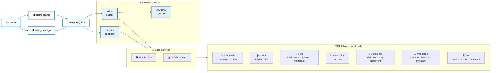

<div align="center">

# 🏠 Home Server Lab

### **Two ways to run a real homelab on a single Raspberry Pi.**
### **🐳 Docker for prototyping. ☸️ k3s + ArgoCD for production.**

*A complete, opinionated, two-stack homelab — DNS · ad-blocking · media · torrents · smart home · automation · dashboards · file sharing · zero-trust remote access — all self-hosted, all in one repo, all on one Pi.*

---

[](https://opensource.org/licenses/MIT)
[](https://www.raspberrypi.org/)
[](https://github.com/awesome-selfhosted/awesome-selfhosted)
[](./CONTRIBUTING.md)

[](./docker/README.md)
[](./k3s/README.md)
[](https://argo-cd.readthedocs.io/)
[](https://traefik.io/)
[](https://github.com/bitnami-labs/sealed-secrets)
[](https://www.twingate.com/)

[](https://github.com/Thre4dripper/Home-Server-Lab/stargazers)
[](https://github.com/Thre4dripper/Home-Server-Lab/network/members)
[](https://github.com/Thre4dripper/Home-Server-Lab/commits/main)

[**🐳 Docker Stack →**](./docker/README.md) ⋅ [**☸️ k3s Stack →**](./k3s/README.md) ⋅ [**⚙️ Ansible →**](./ansible/README.md) ⋅ [**🤝 Contributing →**](./CONTRIBUTING.md)

</div>

---

## 🎯 Why this repo exists

Most homelab projects pick a side: either "here's my `docker-compose.yml` collection" **or** "here's my Helm-charted k3s cluster". This repo refuses to choose, because **both have a place in a serious homelab**:

- **Docker Compose** is unbeatable for *trying things out* — clone, edit env vars, `docker compose up`. Done in ninety seconds.
- **Kubernetes (k3s)** is unbeatable for *running things long-term* — declarative state, GitOps reconciliation, sealed secrets, real ingress, real RBAC.

So this repo gives you both, side-by-side, with the **same set of services modelled twice** — once the easy way, once the production way. Pick a service, prototype it in `docker/`, then promote the working configuration to `k3s/` once you trust it.

Every choice is benchmarked for an **8 GB Raspberry Pi 5**. Everything is reproducible from a clean `git clone`. Nothing depends on a SaaS, a paid plan, or an undocumented click in someone's WebUI.

---

## ⚖️ The two stacks at a glance

| | **🐳 [Docker Stack](./docker/README.md)** | **☸️ [k3s Stack](./k3s/README.md)** |
|---|---|---|
| **Best for** | Prototyping · single-service experiments · learning · "let me try X for an evening" | Production · GitOps · long-running workloads · multi-service composition |
| **Deploy unit** | `docker compose up -d` per service | `kubectl apply -k` per app, then ArgoCD reconciles |
| **Source of truth** | `docker-compose.yml` + `.env` files | YAML manifests + SealedSecrets in git |
| **Networking** | Bridge networks + host port bindings | Traefik IngressRoute + LoadBalancer (klipper-lb) |
| **TLS / certificates** | Manual (or Nginx Proxy Manager UI) | cert-manager + Let's Encrypt, automatic renewal |
| **Secrets** | `.env` files (git-ignored) | SealedSecrets (encrypted, **safe to commit**) |
| **Updates** | `docker compose pull && up -d` | `git push` → ArgoCD auto-syncs |
| **Rollback** | Edit compose / re-pull old tag | `git revert` → ArgoCD un-applies |
| **Recovery** | Re-run `setup.sh`, restore bind mounts | `cluster-restore.sh` + PVCs |
| **Per-service docs** | <!-- AUTOGEN:DOCKER_COUNT -->27<!-- /AUTOGEN:DOCKER_COUNT --> self-contained READMEs | <!-- AUTOGEN:K3S_COUNT -->15<!-- /AUTOGEN:K3S_COUNT --> self-contained READMEs |
| **Resource overhead** | Just Docker daemon (~50 MB RAM) | k3s control plane (~500 MB RAM) |
| **Service count** | **<!-- AUTOGEN:DOCKER_COUNT -->27<!-- /AUTOGEN:DOCKER_COUNT -->** | **<!-- AUTOGEN:K3S_COUNT -->15<!-- /AUTOGEN:K3S_COUNT -->** (and growing) |

> **TL;DR** — Use the Docker stack to try things out. Promote what works to the k3s stack and let ArgoCD run it for you. They share the same Pi, the same Pi-hole DNS, and the same Twingate connector.

---

## 🏗️ Architecture at a glance


```mermaid
graph LR
    Internet[🌐 Internet]
    Twingate[🛡️ Twingate Edge]
    Router[🏠 Home Router]
    Pi[🍓 Raspberry Pi 5]

    subgraph Stacks["🧪 Two Parallel Stacks"]
        direction TB
        Docker[🐳 Docker<br/>compose]
        K3s[☸️ k3s<br/>cluster]
        ArgoCD[🚀 ArgoCD<br/>GitOps]
        K3s --> ArgoCD
    end

    subgraph Edge["🚪 Edge Services"]
        direction TB
        Pihole[🛡️ Pi-hole DNS]
        Traefik[🛣️ Traefik Ingress]
    end

    subgraph Workloads["📦 Self-hosted Workloads"]
        direction TB
        Dash[🏡 Dashboards<br/>Homepage · Homarr]
        Media[🎬 Media<br/>Jellyfin · Plex]
        Files[📁 Files<br/>FileBrowser · Samba · Nextcloud]
        Auto[🤖 Automation<br/>HA · n8n]
        DL[🧲 Downloads<br/>Aria2 · BitComet · qBittorrent]
        Mon[📊 Monitoring<br/>Dashdot · Netdata · Portainer]
        Dev[🛠️ Dev<br/>Gitea · GitLab · LocalStack]
    end

    Internet --> Twingate --> Pi
    Internet --> Router --> Pi
    Pi --> Docker
    Pi --> K3s
    Docker --> Edge
    K3s --> Edge
    Edge --> Workloads

    classDef core fill:#ffffff,stroke:#2196f3,stroke-width:2px,color:#000
    classDef stack fill:#e3f2fd,stroke:#1976d2,stroke-width:2px,color:#000
    class Internet,Twingate,Router,Pi core
    class Docker,K3s,ArgoCD stack
```

A single Pi sits behind a normal home router. **No port forwarding** is required — remote access flows through the Twingate connector, while the LAN gets DNS-level ad blocking and an internal `*.home.ijlalahmad.dev` domain served by Traefik (k3s) or Nginx Proxy Manager (Docker).

---

## 🚀 Quick start

### Option A — "I just want to try one service" (🐳 Docker)

```bash
git clone https://github.com/Thre4dripper/Home-Server-Lab.git
cd Home-Server-Lab/docker/<service>     # e.g. docker/jellyfin
./setup.sh
```

Every Docker service is a self-contained folder with `docker-compose.yml`, `setup.sh` and a per-service `README.md`. The setup script handles env-file scaffolding, directory creation and `docker compose up -d`. → see **[docker/README.md](./docker/README.md)** for the full catalog and detailed walkthrough.

### Option B — "I'm running this for real" (☸️ k3s + ArgoCD)

```bash
# 1. Install k3s (single-node, with default Traefik + klipper-lb)
curl -sfL https://get.k3s.io | sh -

# 2. Bootstrap the cluster
git clone https://github.com/Thre4dripper/Home-Server-Lab.git
cd Home-Server-Lab/k3s
kubectl apply -f base/namespaces/
kubectl apply -k infra/sealed-secrets/
kubectl apply -k infra/traefik/
kubectl apply -k infra/cert-manager/
kubectl apply -k infra/argocd/

# 3. Hand the keys to ArgoCD (one ApplicationSet → one Application per app)
kubectl apply -f infra/argocd/root-app.yaml

# Done. From here, every commit to k3s/apps/** is auto-deployed.
```

→ see **[k3s/README.md](./k3s/README.md)** for the full bootstrap order, secrets workflow and service catalog.

### Option C — "Provision the bare-metal Pi too" (⚙️ Ansible)

```bash
cd Home-Server-Lab/ansible
ansible-playbook -i inventory.yml site.yml
```

Installs Docker, k3s, the Sealed Secrets controller and friends on a fresh Pi — then you're ready for Option A or B.

---

## 📚 Service catalogs

Both stacks publish auto-generated catalog pages with mermaid diagrams and per-category tables:

<!-- AUTOGEN:CATALOG_TABLE -->
| Stack | Catalog | Services | Categories |
|-------|---------|----------|------------|
| 🐳 Docker | **[docker/README.md →](./docker/README.md)** | 27 ready-to-run Compose stacks | 7 |
| ☸️ k3s | **[k3s/README.md →](./k3s/README.md)** | 15 GitOps-managed Kubernetes apps | 9 |
<!-- /AUTOGEN:CATALOG_TABLE -->

Both pages **regenerate automatically** from per-service `README.md` frontmatter via GitHub Actions — see [Automation](#-automation).

---

## 🎯 Project philosophy

- **🔒 Privacy first** — Your data, your hardware, your rules. No SaaS dependencies, no telemetry, no third-party clouds in the critical path.
- **🏗️ Production-grade patterns** — Real ingress, real secrets management, real GitOps — *even on a Pi*. The k3s stack is structured exactly the way you'd structure a small production cluster.
- **📦 Single-board friendly** — Every service has a benchmarked RAM/CPU footprint. The full Docker catalog runs comfortably on an 8 GB Pi 5.
- **🧪 Reproducible from zero** — `git clone` → bootstrap → working homelab. No undocumented manual clicks. No "oh, you also need to…".
- **📖 Self-documenting** — Every service carries machine-readable YAML frontmatter. The catalog pages, mermaid diagrams and category tables are derived from that frontmatter, so they cannot drift out of sync with reality.
- **🎓 Educational** — Each per-service README is structured to teach: *Why this service · How it's wired · What can go wrong · How to fix it.*

---

## 🛠️ Tech stack

<div align="center">


</div>

| Layer | Docker stack | k3s stack |
|-------|--------------|-----------|
| **Container runtime** | Docker Engine | containerd (via k3s) |
| **Orchestration** | docker compose | k3s (Kubernetes 1.28+) |
| **Ingress / proxy** | Nginx Proxy Manager (`nginx-ui`) | Traefik (built into k3s) |
| **Load balancer** | host port bindings | klipper-lb (built into k3s) |
| **TLS** | Manual / Let's Encrypt via NPM | cert-manager + Let's Encrypt |
| **Secrets** | `.env` files (git-ignored) | Bitnami SealedSecrets (encrypted in git) |
| **Deployment automation** | per-service `setup.sh` | per-app `setup.sh` + ArgoCD |
| **Remote access** | Twingate connector container | Twingate connector Pod |
| **DNS** | Pi-hole container | Pi-hole Pod (`hostNetwork: true`) |
| **CI** | GitHub Actions (README + frontmatter) | GitHub Actions (README + frontmatter) |

---

## 💻 System requirements

The reference deployment is a **Raspberry Pi 5 (8 GB) with an external SSD over USB 3** running Raspberry Pi OS Bookworm 64-bit.

| Component | Minimum | Recommended | Notes |
|-----------|---------|-------------|-------|
| **CPU** | ARM64 quad-core 1.5 GHz | Pi 5 / x86_64 4-core | Both stacks are arch-agnostic where the underlying images are |
| **RAM** | 4 GB | 8 GB | k3s adds ~500 MB baseline; full Docker catalog needs 6 GB+ |
| **Storage** | 32 GB SD card | 256 GB+ NVMe / SSD | Move `/var/lib/{docker,rancher}` to SSD for sane I/O |
| **Network** | 100 Mbit Ethernet | Gigabit Ethernet | Multicast / Wi-Fi is hostile to Home Assistant discovery |
| **Power** | 3 A USB-C | Official Pi 5 PSU | SD-card corruption on under-volt is a common Pi pitfall |

### Resource planning by use case

| Profile | Services | Total RAM | Storage | Stack |
|---------|----------|-----------|---------|-------|
| **Minimal** | Pi-hole + Portainer + Homepage | ~400 MB | 16 GB | 🐳 Docker |
| **Media hub** | + Jellyfin + qBittorrent + FileBrowser | ~2 GB | 256 GB+ | 🐳 Docker |
| **Smart home** | + Home Assistant + n8n + Mosquitto | ~3 GB | 32 GB | 🐳 Docker |
| **Production cluster** | k3s + Traefik + ArgoCD + 8–10 apps | ~4 GB | 128 GB+ | ☸️ k3s |
| **Full lab** | Both stacks side-by-side | ~6–7 GB | 256 GB+ | 🐳 + ☸️ |

---

## 🛡️ Security posture

This is a **homelab**, not a production SaaS, but the patterns used here are real:

- ✅ **No inbound port forwarding** — remote access flows through the Twingate connector (outbound-only TCP/443 to the Twingate edge).
- ✅ **Secrets never in git plaintext** — Docker uses `.env` files (git-ignored); k3s uses Bitnami SealedSecrets, which are encrypted with the cluster's public key and only decryptable inside the cluster.
- ✅ **TLS everywhere** — k3s ingress is fronted by cert-manager + Let's Encrypt; Docker stack uses Nginx Proxy Manager with the same provider.
- ✅ **Network segmentation** — Docker isolates each stack on its own bridge network; k3s isolates by namespace, with `NetworkPolicy` available where needed.
- ✅ **Least-privilege RBAC** — k3s service accounts (e.g. Homepage's kubernetes widget) are bound to read-only ClusterRoles, never `cluster-admin` (except Portainer, which is opt-in and called out).
- ✅ **DNS-level filtering** — Pi-hole blocks ads, trackers and known-malicious domains for every device on the LAN.
- ✅ **Resource limits** — every Pod has CPU + memory requests/limits to prevent one runaway container from OOM-killing the host.

What this **does not** give you out of the box:

- ❌ DDoS protection (you're not on the public internet)
- ❌ WAF / app-layer firewall (overkill for a homelab; add Crowdsec if you want it)
- ❌ Hardware-attested boot (Pi limitation)

→ Every per-service README has its own *Troubleshooting* and *Hardening notes* sections.

---

## 🤖 Automation

This repo is itself GitOps — the documentation, the catalog and the diagrams are all reconciled from the source of truth, which is each service's `README.md` frontmatter.

| Workflow | Trigger | Effect |
|----------|---------|--------|
| [`update-readme.yml`](./.github/workflows/update-readme.yml) | Any per-service README change in `docker/*` or `k3s/apps/*` | Regenerates **all three** catalogs — `docker/README.md`, `k3s/README.md` and the root `README.md` — in a single matrix job |
| [`validate-metadata.yml`](./.github/workflows/validate-metadata.yml) | PRs touching any service README | Validates frontmatter schema for both stacks (required fields, allowed categories, valid icons) |

The matrix-based generator is a [single workflow file](./.github/workflows/update-readme.yml) that runs `update-docker-readme.py`, `update-k3s-readme.py` and `update-global-readme.py` in parallel and commits/pushes (or PR-comments) any regenerated catalog. Inside the root README, only the segments wrapped in `<!-- AUTOGEN:* -->` markers are touched — every other line is yours.

**Add a service → write its README with the right frontmatter → push → the catalog updates itself.**

---

## 📁 Repository layout

```
Home-Server-Lab/
├── README.md                     ← you are here
├── docker/                       🐳 Docker Compose stack — <!-- AUTOGEN:DOCKER_COUNT -->27<!-- /AUTOGEN:DOCKER_COUNT --> services
│   ├── README.md                     auto-generated catalog + mermaid
│   └── <service>/                    docker-compose.yml + setup.sh + README.md (frontmatter)
├── k3s/                          ☸️  k3s + ArgoCD stack — <!-- AUTOGEN:K3S_COUNT -->15<!-- /AUTOGEN:K3S_COUNT --> apps
│   ├── README.md                     auto-generated catalog + mermaid + bootstrap docs
│   ├── base/                         shared namespaces
│   ├── infra/                        Traefik · SealedSecrets · cert-manager · ArgoCD
│   ├── apps/<service>/               manifests + setup.sh + README.md (frontmatter)
│   └── scripts/                      shared helpers (_app-ctl.sh, seal.sh, db-user.sh, …)
├── ansible/                      ⚙️  Bare-metal & host bootstrap (Docker, k3s, sealed-secrets)
└── .github/
    ├── scripts/                      update-docker-readme.py · update-k3s-readme.py · validate-service.py
    └── workflows/                    update-readme.yml · validate-metadata.yml
```

---

## ❓ FAQ

<details>
<summary><b>Why both Docker AND k3s? Isn't that redundant?</b></summary>

No — they serve different purposes. The Docker stack is for *trying* things; the k3s stack is for *running* them. You'll spin up a service in Docker for an afternoon to learn how it works, then promote it to k3s once you trust the configuration. Removing one would force every experiment through the production deployment path, which is friction you don't want when you're tinkering.

</details>

<details>
<summary><b>Do I need to run both?</b></summary>

No. They're independent. The Docker stack works on any Linux host with Docker. The k3s stack works on any host with k3s (or full k8s). Pick one or both.

</details>

<details>
<summary><b>Why k3s and not full Kubernetes?</b></summary>

k3s is full Kubernetes — same APIs, same `kubectl`, same manifests. It just ships as a single binary, replaces etcd with SQLite by default, and is built for ARM/edge. Everything in `k3s/apps/` would work unchanged on EKS / GKE / AKS / k0s / minikube.

</details>

<details>
<summary><b>Can I run this on x86_64 / Intel / AMD?</b></summary>

Yes. Every image used here ships multi-arch manifests (`linux/amd64` + `linux/arm64`). The Pi 5 is the reference platform, but nothing forces it.

</details>

<details>
<summary><b>How do I add my own service?</b></summary>

Pick a stack, copy the closest existing service folder, edit the manifests/compose file, write a README with the required frontmatter, push. The catalog regenerates itself. Full guide in [CONTRIBUTING.md](./CONTRIBUTING.md).

</details>

<details>
<summary><b>How do I expose a service to the public internet?</b></summary>

You don't need to. Twingate is the recommended path — it's outbound-only, identity-aware and works through CGNAT. If you really want public exposure, both stacks support it: Docker via Nginx Proxy Manager + Let's Encrypt, k3s via Traefik + cert-manager + a router port-forward.

</details>

<details>
<summary><b>What about backups?</b></summary>

- **Docker**: every service uses bind-mounted volumes under `<service>/data/`. A `tar.gz` of the repo + `data/` folders is your backup.
- **k3s**: PVCs use `Retain` reclaim policy. For logical DB backups see `k3s/apps/databases/README.md`. For full cluster snapshots, the `cluster-restore.sh` helper exists.

</details>

<details>
<summary><b>Does this work behind CGNAT / on a phone hotspot / on a hostile network?</b></summary>

Yes — that's exactly why Twingate is the recommended remote-access path. It only requires outbound HTTPS.

</details>

---

## 🤝 Contributing

Contributions are welcome — adding a service, fixing a manifest, improving docs, sharing benchmarks.

- See **[CONTRIBUTING.md](./CONTRIBUTING.md)** for the full workflow.
- See **[CODE_OF_CONDUCT.md](./CODE_OF_CONDUCT.md)** for community standards.

The TL;DR for adding a service:

<details>
<summary><b>🐳 Add a Docker service</b></summary>

```bash
mkdir docker/my-app && cd docker/my-app
# create docker-compose.yml, setup.sh, README.md (with frontmatter)
git add . && git commit -m "feat(docker): add my-app"
git push   # docker/README.md regenerates automatically
```

Required frontmatter fields: `name`, `category`, `purpose`, `description`, `icon`, `features`, `resource_usage`. See any existing service for an example.

</details>

<details>
<summary><b>☸️ Add a k3s service</b></summary>

```bash
cd k3s
./scripts/new-service.sh my-app
# fill in manifests + write apps/my-app/README.md with frontmatter
git add . && git commit -m "feat(k3s): add my-app"
git push   # k3s/README.md regenerates and ArgoCD deploys
```

Required frontmatter fields: `name`, `category`, `purpose`, `description`, `icon`, `namespace`, `components`, `features`, `resource_usage`.

</details>

---

## 📄 License

[MIT](./LICENSE) — do whatever you want, just keep the notice.

---

## 🙏 Acknowledgements

Built on the shoulders of giants:

- The **self-hosted community** — [awesome-selfhosted](https://github.com/awesome-selfhosted/awesome-selfhosted), [r/selfhosted](https://reddit.com/r/selfhosted), [r/homelab](https://reddit.com/r/homelab)
- **[k3s](https://k3s.io/)** — for making real Kubernetes possible on a Pi
- **[ArgoCD](https://argo-cd.readthedocs.io/)** — for GitOps that actually works
- **[Bitnami SealedSecrets](https://github.com/bitnami-labs/sealed-secrets)** — for letting secrets live in git, safely
- **[Traefik](https://traefik.io/)** + **[cert-manager](https://cert-manager.io/)** — for ingress that just works
- **[Twingate](https://www.twingate.com/)** — for zero-trust remote access without port forwarding
- **[Raspberry Pi Foundation](https://www.raspberrypi.org/)** — for affordable, capable hardware
- And every open-source project listed in the catalogs — none of this exists without them

---

<div align="center">

### **If this repo helped you build something cool, [⭐ star it](https://github.com/Thre4dripper/Home-Server-Lab) — it's the best way to help others find it.**

[](https://github.com/Thre4dripper/Home-Server-Lab/stargazers)
[](https://github.com/Thre4dripper/Home-Server-Lab/network/members)
[](https://github.com/Thre4dripper/Home-Server-Lab/watchers)

*Built one container, one manifest and one Pi at a time.*

</div>
