# 🏠 Home Server Lab

[](https://opensource.org/licenses/MIT)
[](https://docs.docker.com/compose/)
[](https://github.com/awesome-selfhosted/awesome-selfhosted)
[](https://www.raspberrypi.org/)

> **A comprehensive collection of self-hosted services for your home lab, optimized for Raspberry Pi and other single-board computers.**

Transform your home network into a powerful, privacy-focused digital ecosystem with enterprise-grade services running on your own hardware. This repository provides battle-tested Docker configurations for essential self-hosted applications.

## 🎯 **Project Philosophy**

- **Privacy First**: Keep your data under your control
- **Production Ready**: Enterprise-grade configurations optimized for home use  
- **Resource Efficient**: Designed for single-board computers like Raspberry Pi
- **Easy Deployment**: One-command setup with comprehensive documentation
- **Security Focused**: Secure defaults with optional hardening guides

## 🏷️ **Service Categories**

| Category | Description | Services |
|----------|-------------|----------|
| 🎬 Media & Entertainment | Media servers and streaming | Jellyfin, Plex |
| 🏡 Dashboard & Network Services | Network services and dashboards | Dashy, Homarr, Nginx Proxy Manager, Pi-hole |
| 📁 File Management & Collaboration | File storage, synchronization and collaboration | FileBrowser, Nextcloud, Pydio, Seafile Pro, +1 more |
| 📊 Monitoring & Stats | System statistics and performance dashboards | Dashdot, Netdata, Portainer |
| 🔄 Automation & Workflow | Workflow automation and task scheduling | n8n |
| 🛠️ Development & DevOps | Development tools and CI/CD | GitLab, Gitea, LocalStack |
| 🧲 Download Managers | Torrent and download management | Deluge, qBittorrent |

## 🏗️ **Architecture Overview**

> **📝 Note:** This architecture diagram is automatically generated from service metadata. Changes will be reflected when services are added or modified.

```mermaid
graph LR
    Internet[🌐 Internet]
    Router[🏠 Home Router]
    RPI[🍓 Raspberry Pi]
    Docker[🐳 Docker]
    
    Internet --> Router
    Router --> RPI
    RPI --> Docker
    
    %% Core Infrastructure
    subgraph Core["🏗️ Core Infrastructure"]
        direction TB
    end


    %% 🎬 Media & Entertainment
    subgraph MediaEntertainment["🎬 Media & Entertainment"]
        direction TB
        Jellyfin[🎬<br/>Jellyfin]
        Plex[🎬<br/>Plex]
        Jellyfin --- Plex
    end
    Docker -.-> Jellyfin
    Docker -.-> Plex

    %% 🏡 Dashboard & Network Services
    subgraph DashboardNetworkServices["🏡 Dashboard & Network Services"]
        direction TB
        Dashy[🎯<br/>Dashy]
        Homarr[🏡<br/>Homarr]
        Nginxui[🔀<br/>Nginx Proxy Manager]
        Pihole[🛡️<br/>Pi-hole]
        Dashy --- Homarr
        Nginxui --- Pihole
    end
    Docker -.-> Dashy
    Docker -.-> Homarr
    Docker -.-> Nginxui
    Docker -.-> Pihole

    %% 📁 File Management & Collaboration
    subgraph FileManagementCollaboration["📁 File Management & Collaboration"]
        direction TB
        Filebrowser[📂<br/>FileBrowser]
        Nextcloud[☁️<br/>Nextcloud]
        Pydio[📁<br/>Pydio]
        Seafile[🌊<br/>Seafile Pro]
        Owncloud[☁️<br/>ownCloud]
        Filebrowser --- Nextcloud
        Pydio --- Seafile
    end
    Docker -.-> Filebrowser
    Docker -.-> Nextcloud
    Docker -.-> Pydio
    Docker -.-> Seafile
    Docker -.-> Owncloud

    %% 📊 Monitoring & Stats
    subgraph MonitoringStats["📊 Monitoring & Stats"]
        direction TB
        Dashdot[📊<br/>Dashdot]
        Netdata[📈<br/>Netdata]
        Portainer[📊<br/>Portainer]
        Dashdot --- Netdata
    end
    Docker -.-> Dashdot
    Docker -.-> Netdata
    Docker -.-> Portainer

    %% 🔄 Automation & Workflow
    subgraph AutomationWorkflow["🔄 Automation & Workflow"]
        direction TB
        N8N[🔄<br/>n8n]
    end
    Docker -.-> N8N

    %% 🛠️ Development & DevOps
    subgraph DevelopmentDevOps["🛠️ Development & DevOps"]
        direction TB
        Gitlab[🦊<br/>GitLab]
        Gitea[🍃<br/>Gitea]
        Localstack[☁️<br/>LocalStack]
        Gitlab --- Gitea
    end
    Docker -.-> Gitlab
    Docker -.-> Gitea
    Docker -.-> Localstack

    %% 🧲 Download Managers
    subgraph DownloadManagers["🧲 Download Managers"]
        direction TB
        Deluge[🧲<br/>Deluge]
        Qbittorrent[📥<br/>qBittorrent]
        Deluge --- Qbittorrent
    end
    Docker -.-> Deluge
    Docker -.-> Qbittorrent

    %% Custom Styling for better visibility and contrast
    classDef coreInfra fill:#ffffff,stroke:#2196f3,stroke-width:2px,color:#000000
    classDef infraNode fill:#e3f2fd,stroke:#1976d2,stroke-width:2px,color:#000000
    classDef monitoringNode fill:#fff3e0,stroke:#f57c00,stroke-width:2px,color:#000000
    classDef downloadNode fill:#e8f5e8,stroke:#4caf50,stroke-width:2px,color:#000000
    classDef mediaNode fill:#fce4ec,stroke:#e91e63,stroke-width:2px,color:#000000
    classDef nasNode fill:#f3e5f5,stroke:#9c27b0,stroke-width:2px,color:#000000
    classDef automationNode fill:#e0f2f1,stroke:#009688,stroke-width:2px,color:#000000
    classDef devNode fill:#fff8e1,stroke:#ff9800,stroke-width:2px,color:#000000
    classDef dashNode fill:#f9fbe7,stroke:#8bc34a,stroke-width:2px,color:#000000
    
    class Internet,Router,RPI,Docker coreInfra
    class Jellyfin,Plex mediaNode
    class Dashy,Homarr,Nginxui,Pihole dashNode
    class Filebrowser,Nextcloud,Pydio,Seafile,Owncloud nasNode
    class Dashdot,Netdata,Portainer monitoringNode
    class N8N automationNode
    class Gitlab,Gitea,Localstack devNode
    class Deluge,Qbittorrent downloadNode
```




## 🚀 **Available Services**

> **📝 Note:** This section is automatically generated from individual service README.md files. To update service information, edit the respective service's README.md file and the changes will be reflected here automatically.

### 📊 Monitoring & Stats

| Service | Purpose | Key Features | Resource Usage |
|---------|---------|--------------|----------------|
| [**Dashdot**](./dashdot/) | Server Resource Monitoring | Real-time CPU, RAM, Storage, Network, and GPU monitoring, CPU temperature mon... | ~50MB RAM |
| [**Netdata**](./netdata/) | Real-time System Monitoring | Real-time metrics with 1-second granularity, Interactive web dashboards, Smar... | ~250MB RAM |
| [**Portainer**](./portainer/) | Container Management | Complete Docker management interface, Multi-user support with RBAC, Applicati... | ~100MB RAM |

### 🧲 Download Managers

| Service | Purpose | Key Features | Resource Usage |
|---------|---------|--------------|----------------|
| [**Deluge**](./deluge/) | BitTorrent Client | Web-based user interface, Torrent management and monitoring, Bandwidth limiti... | ~200MB RAM |
| [**qBittorrent**](./qbittorrent/) | BitTorrent Client | Web-based UI for remote access, Sequential downloading support, RSS feed supp... | ~500MB RAM |

### 🎬 Media & Entertainment

| Service | Purpose | Key Features | Resource Usage |
|---------|---------|--------------|----------------|
| [**Jellyfin**](./jellyfin/) | Self-hosted Media Server | Stream movies, TV, music, and photos, Multi-user with permissions, Hardware a... | ~1GB RAM |
| [**Plex**](./plex/) | Media Server | Stream personal media anywhere, Cross-platform device support, Hardware trans... | ~1GB RAM |

### 📁 File Management & Collaboration

| Service | Purpose | Key Features | Resource Usage |
|---------|---------|--------------|----------------|
| [**FileBrowser**](./filebrowser/) | Web-based File Manager | Browse and manage server files, Upload/download files via web, Create, edit, ... | ~100MB RAM |
| [**Nextcloud**](./nextcloud/) | Self-hosted file sync and share | File sync and sharing, Calendar and contacts, Office document editing | ~1-2GB RAM (scales with usage) |
| [**Pydio**](./pydio/) | File Management Platform | Web-based file management, Team collaboration tools, External storage integra... | ~400MB RAM |
| [**Seafile Pro**](./seafile/) | Enterprise File Sync | Real-time collaboration and editing, Desktop and mobile sync clients, Enterpr... | ~1GB RAM |
| [**ownCloud**](./owncloud/) | File Synchronization & Sharing | Self-hosted file sync and share, Web interface and mobile apps, User manageme... | ~800MB RAM |

### 🔄 Automation & Workflow

| Service | Purpose | Key Features | Resource Usage |
|---------|---------|--------------|----------------|
| [**n8n**](./n8n/) | Workflow Automation | Visual workflow builder, 300+ integrations, API and webhook support | ~300MB RAM |

### 🛠️ Development & DevOps

| Service | Purpose | Key Features | Resource Usage |
|---------|---------|--------------|----------------|
| [**GitLab**](./gitlab/) | Full DevOps Platform | Git repos with CI/CD pipelines, Issue tracking and project management, Contai... | ~2GB RAM |
| [**Gitea**](./gitea/) | Lightweight Git Service | Git hosting with web interface, Pull requests and code review, Issue tracking... | ~200MB RAM |
| [**LocalStack**](./localstack/) | AWS Cloud Emulation | Local AWS services emulation, Development and testing platform, Cloud dashboa... | ~500MB RAM |

### 🏡 Dashboard & Network Services

| Service | Purpose | Key Features | Resource Usage |
|---------|---------|--------------|----------------|
| [**Dashy**](./dashy/) | Service Dashboard | Customizable dashboard interface, Service status monitoring, Advanced search ... | ~150MB RAM |
| [**Homarr**](./homarr/) | Homepage Dashboard | Customizable homepage dashboard, Service integration and monitoring, Modern r... | ~200MB RAM |
| [**Nginx Proxy Manager**](./nginx-ui/) | Reverse Proxy Management UI | Web UI for reverse proxy setup, Free SSL with Let's Encrypt, Access lists and... | ~400MB RAM |
| [**Pi-hole**](./pihole/) | Network Ad Blocker | Network-wide ad blocking, DNS-level filtering, Detailed query analytics | ~100MB RAM |


## 🚀 **Quick Start**

### Prerequisites

- **Hardware**: Raspberry Pi 4 (4GB+ RAM recommended) or any Linux server
- **OS**: Ubuntu 20.04+ / Raspberry Pi OS / Any Docker-compatible Linux
- **Software**: Docker & Docker Compose installed

### 1. Clone Repository

```bash
git clone https://github.com/Thre4dripper/Home-Server-Lab.git
cd Home-Server-Lab
```

### 2. Choose Your Services

Each service is self-contained with its own configuration:

```bash
# Deploy individual services
cd netdata && ./setup.sh    # System monitoring
cd ../portainer && ./setup.sh    # Container management  
cd ../seafile && ./setup.sh      # File collaboration
```

### 3. Access Your Services

After deployment, access services via your server IP:

- **Portainer**: http://your-server-ip:9000
- **Netdata**: http://your-server-ip:19999
- **Seafile**: http://your-server-ip:8000
- **And more...** (check individual service documentation)

## 📋 **System Requirements**

### Minimum Configuration
- **RAM**: 4GB (recommended 8GB+)
- **Storage**: 32GB+ SD card/SSD
- **Network**: Ethernet connection recommended
- **Power**: 3A+ power supply for Raspberry Pi

### Resource Planning

| Configuration | Services | Total RAM | Storage |
|---------------|----------|-----------|---------|
| **Basic** | Portainer + Netdata + Pi-hole | ~500MB | 16GB |
| **Developer** | + GitLab + n8n + LocalStack | ~3GB | 32GB |
| **Media Hub** | + Plex + Seafile + Dashboards | ~5GB | 64GB+ |
| **Full Stack** | All Services | ~8GB+ | 128GB+ |

## 🛡️ **Security & Best Practices**

### Built-in Security Features

- **Environment Isolation**: Each service runs in isolated containers
- **Secret Management**: Sensitive data in `.env` files (git-ignored)
- **Network Segmentation**: Internal Docker networks for service communication
- **Resource Limits**: Memory and CPU constraints prevent resource exhaustion
- **Health Checks**: Automatic service health monitoring and recovery

### Recommended Security Measures

1. **Change Default Passwords**: Update all default credentials
2. **Enable Firewall**: Configure UFW or iptables
3. **Use Strong Authentication**: Enable 2FA where available
4. **Regular Updates**: Keep containers and host system updated
5. **Backup Strategy**: Implement automated backups
6. **Reverse Proxy**: Use Nginx/Traefik for HTTPS termination

## 🔧 **Management Commands**

### Global Operations

```bash
# Check all running services
docker ps

# View resource usage
docker stats

# Update all services
find . -name "docker-compose.yml" -execdir docker compose pull \;
find . -name "docker-compose.yml" -execdir docker compose up -d \;

# Backup all data
tar -czf homelab-backup-$(date +%Y%m%d).tar.gz */data/ */.env

# System cleanup
docker system prune -f
docker volume prune -f
```

### Service-Specific Operations

Each service includes standardized management scripts:

```bash
cd <service-directory>
./setup.sh          # Initial deployment
docker compose logs -f   # View logs
docker compose restart  # Restart service
docker compose down     # Stop service
```

## 📊 **Monitoring & Maintenance**

### Health Monitoring

- **Netdata Dashboard**: Real-time system metrics at http://your-server-ip:19999
- **Portainer**: Container status and resource usage
- **Service Health Checks**: Built-in Docker health monitoring
- **Log Aggregation**: Centralized logging via Docker

### Maintenance Schedule

| Task | Frequency | Command |
|------|-----------|---------|
| **Check Service Health** | Daily | `docker ps` |
| **Review Logs** | Weekly | `docker compose logs` |
| **Update Containers** | Monthly | `docker compose pull && docker compose up -d` |
| **System Backup** | Weekly | Custom backup scripts |
| **Clean Docker Cache** | Monthly | `docker system prune` |

## 🤝 **Contributing**

We welcome contributions! Please see our [Contributing Guidelines](./CONTRIBUTING.md) for details on:

- Adding new services
- Improving existing configurations
- Reporting bugs and feature requests
- Documentation improvements

## 📜 **Code of Conduct**

This project adheres to a [Code of Conduct](./CODE_OF_CONDUCT.md) to ensure a welcoming environment for all contributors.

## 📚 **Documentation Structure**

Each service includes comprehensive documentation:

```
service-name/
├── README.md              # Service-specific guide
├── docker-compose.yml     # Container configuration
├── .env.example          # Configuration template
├── setup.sh              # Automated deployment
├── .gitignore            # Exclude sensitive data
└── data/                 # Persistent data (bind mounted)
```

## 🔗 **Useful Links**

### Official Documentation
- [Docker Documentation](https://docs.docker.com/)
- [Docker Compose Reference](https://docs.docker.com/compose/)
- [Raspberry Pi Documentation](https://www.raspberrypi.org/documentation/)

### Community Resources
- [Awesome Self-Hosted](https://github.com/awesome-selfhosted/awesome-selfhosted)
- [r/selfhosted](https://reddit.com/r/selfhosted)
- [Home Lab Community](https://www.reddit.com/r/homelab/)

### Security Resources
- [Docker Security Best Practices](https://docs.docker.com/engine/security/)
- [Self-Hosted Security Guide](https://github.com/imthenachoman/How-To-Secure-A-Linux-Server)

## 📄 **License**

This project is licensed under the MIT License - see the [LICENSE](./LICENSE) file for details.

## 🙏 **Acknowledgments**

- Thanks to the open-source community for creating amazing self-hosted solutions
- Special recognition to developers of each service for their excellent work
- Raspberry Pi Foundation for making affordable computing accessible
- Docker team for revolutionizing application deployment

---

<div align="center">

**[⭐ Star this repository](https://github.com/Thre4dripper/Home-Server-Lab) if you find it useful!**

[](https://github.com/Thre4dripper/Home-Server-Lab/stargazers)
[](https://github.com/Thre4dripper/Home-Server-Lab/network/members)

*Building the future of self-hosted home labs, one container at a time.*

</div>