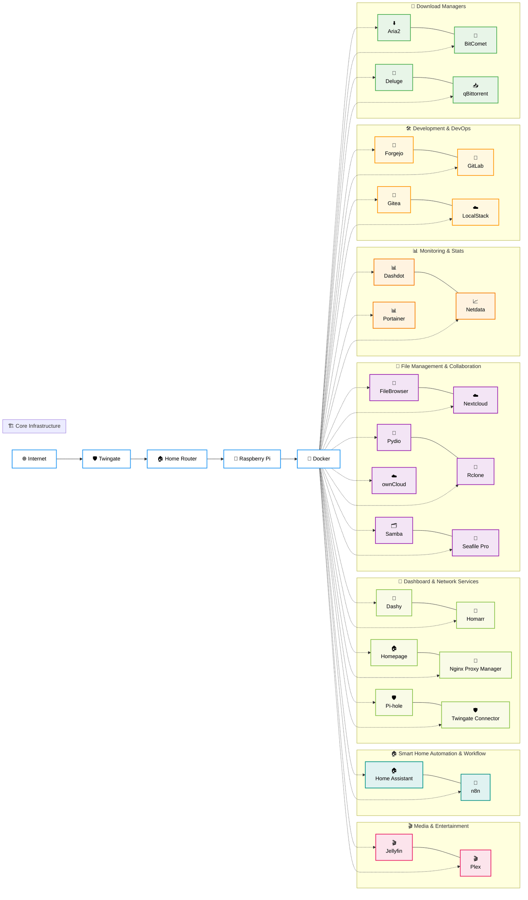

# 🐳 Docker Stack

[](https://docs.docker.com/compose/)
[](https://github.com/awesome-selfhosted/awesome-selfhosted)
[](https://docs.docker.com/build/building/multi-platform/)

> **27 production-ready Docker Compose stacks for your homelab — one folder per service, one `setup.sh` to bring it up, one `README.md` to explain it.**

This is the **Docker half** of the [Home Server Lab](../README.md) two-stack setup. Use this stack when you want to *try* things fast, prototype a service for an evening, or run a single-host setup without the overhead of a Kubernetes cluster. For the production-grade GitOps version of the same services, see **[../k3s/](../k3s/README.md)**.

> 💡 The repo's [global README](../README.md) covers project philosophy, two-stack comparison, security posture, FAQ and contributing — those are not duplicated here.

## 🏷️ **Service Categories**

| Category | Description | Services |
|----------|-------------|----------|
| 🎬 Media & Entertainment | Media servers and streaming | Jellyfin, Plex |
| 🏠 Smart Home Automation & Workflow | Workflow automation and task scheduling | Home Assistant, n8n |
| 🏡 Dashboard & Network Services | Network services and dashboards | Dashy, Homarr, Homepage, Nginx Proxy Manager, +2 more |
| 📁 File Management & Collaboration | File storage, synchronization and collaboration | FileBrowser, Nextcloud, Pydio, Rclone, +3 more |
| 📊 Monitoring & Stats | System statistics and performance dashboards | Dashdot, Netdata, Portainer |
| 🛠️ Development & DevOps | Development tools and CI/CD | Forgejo, GitLab, Gitea, LocalStack |
| 🧲 Download Managers | Torrent and download management | Aria2, BitComet, Deluge, qBittorrent |


## 🏗️ **Architecture Overview**

> **📝 Note:** This architecture diagram is automatically generated from service metadata. Changes will be reflected when services are added or modified.




## 🚀 **Available Services**

> **📝 Note:** This section is automatically generated from individual service README.md files. To update service information, edit the respective service's README.md file and the changes will be reflected here automatically.

### 📊 Monitoring & Stats

| Service | Purpose | Key Features | Resource Usage |
|---------|---------|--------------|----------------|
| [**Dashdot**](./dashdot/) | Server Resource Monitoring | Real-time CPU, RAM, Storage, Network, and GPU monitoring, CPU temperature mon... | ~50MB RAM |
| [**Netdata**](./netdata/) | Real-time System Monitoring | Real-time metrics with 1-second granularity, Interactive web dashboards, Smar... | ~250MB RAM |
| [**Portainer**](./portainer/) | Container Management | Complete Docker management interface, Multi-user support with RBAC, Applicati... | ~100MB RAM |

### 🧲 Download Managers

| Service | Purpose | Key Features | Resource Usage |
|---------|---------|--------------|----------------|
| [**Aria2**](./aria2-ui/) | Multi-Protocol Download Manager | HTTP/HTTPS/FTP/BitTorrent/Metalink support, Web UI (AriaNg), RPC interface fo... | ~100MB RAM |
| [**BitComet**](./bitcomet/) | BitTorrent Client | Web-based UI for remote access, Long-term seeding support, Intelligent disk c... | ~256MB RAM |
| [**Deluge**](./deluge/) | BitTorrent Client | Web-based user interface, Torrent management and monitoring, Bandwidth limiti... | ~200MB RAM |
| [**qBittorrent**](./qbittorrent/) | BitTorrent Client | Web-based UI for remote access, Sequential downloading support, RSS feed supp... | ~500MB RAM |

### 🎬 Media & Entertainment

| Service | Purpose | Key Features | Resource Usage |
|---------|---------|--------------|----------------|
| [**Jellyfin**](./jellyfin/) | Self-hosted Media Server | Stream movies, TV, music, and photos, Multi-user with permissions, Hardware a... | ~1GB RAM |
| [**Plex**](./plex/) | Media Server | Stream personal media anywhere, Cross-platform device support, Hardware trans... | ~1GB RAM |

### 📁 File Management & Collaboration

| Service | Purpose | Key Features | Resource Usage |
|---------|---------|--------------|----------------|
| [**FileBrowser**](./filebrowser/) | Web-based File Manager | Browse and manage server files, Upload/download files via web, Create, edit, ... | ~100MB RAM |
| [**Nextcloud**](./nextcloud/) | Self-hosted file sync and share | File sync and sharing, Calendar and contacts, Office document editing | ~1-2GB RAM (scales with usage) |
| [**Pydio**](./pydio/) | File Management Platform | Web-based file management, Team collaboration tools, External storage integra... | ~400MB RAM |
| [**Rclone**](./rclone/) | Cloud Storage Sync & Management | 70+ cloud storage providers support, Mount cloud storage as local filesystem,... | ~50MB RAM |
| [**Samba**](./samba/) | Network File Sharing | Windows/Mac/Linux file sharing, Guest and authenticated access, Configurable ... | ~50MB RAM |
| [**Seafile Pro**](./seafile/) | Enterprise File Sync | Real-time collaboration and editing, Desktop and mobile sync clients, Enterpr... | ~1GB RAM |
| [**ownCloud**](./owncloud/) | File Synchronization & Sharing | Self-hosted file sync and share, Web interface and mobile apps, User manageme... | ~800MB RAM |

### 🏠 Smart Home Automation & Workflow

| Service | Purpose | Key Features | Resource Usage |
|---------|---------|--------------|----------------|
| [**Home Assistant**](./home-assistant/) | Home Automation Platform | Local control and privacy, 1000+ integrations, Automation engine | ~500MB RAM |
| [**n8n**](./n8n/) | Workflow Automation | Visual workflow builder, 300+ integrations, API and webhook support | ~300MB RAM |

### 🛠️ Development & DevOps

| Service | Purpose | Key Features | Resource Usage |
|---------|---------|--------------|----------------|
| [**Forgejo**](./forgejo/) | Self-hosted Git Service with CI/CD | Git hosting with web interface, Pull requests and code review, Issue tracking... | ~256MB RAM (server), ~128MB RAM (runner) |
| [**GitLab**](./gitlab/) | Full DevOps Platform | Git repos with CI/CD pipelines, Issue tracking and project management, Contai... | ~2GB RAM |
| [**Gitea**](./gitea/) | Lightweight Git Service | Git hosting with web interface, Pull requests and code review, Issue tracking... | ~200MB RAM |
| [**LocalStack**](./localstack/) | AWS Cloud Emulation | Local AWS services emulation, Development and testing platform, Cloud dashboa... | ~500MB RAM |

### 🏡 Dashboard & Network Services

| Service | Purpose | Key Features | Resource Usage |
|---------|---------|--------------|----------------|
| [**Dashy**](./dashy/) | Service Dashboard | Customizable dashboard interface, Service status monitoring, Advanced search ... | ~150MB RAM |
| [**Homarr**](./homarr/) | Homepage Dashboard | Customizable homepage dashboard, Service integration and monitoring, Modern r... | ~200MB RAM |
| [**Homepage**](./homepage/) | Homepage Dashboard | YAML-based configuration, Docker integration with container stats, Service he... | ~128MB RAM |
| [**Nginx Proxy Manager**](./nginx-ui/) | Reverse Proxy Management UI | Web UI for reverse proxy setup, Free SSL with Let's Encrypt, Access lists and... | ~400MB RAM |
| [**Pi-hole**](./pihole/) | Network Ad Blocker | Network-wide ad blocking, DNS-level filtering, Detailed query analytics | ~100MB RAM |
| [**Twingate Connector**](./twingate/) | Zero-Trust Remote Access | Outbound-only connector for safe remote access, Automatic labeling for auditi... | ~75MB RAM |


## 🏠 **Quick Start**

### Prerequisites

- **Hardware**: Any Linux server with 4GB+ RAM (tested on Raspberry Pi 4/5, Intel NUC, x86_64 VMs)
- **OS**: Ubuntu 20.04+ / Debian 11+ / Raspberry Pi OS / any Docker-compatible Linux
- **Software**: Docker Engine + Docker Compose v2

```bash
# Quick install (Debian / Ubuntu / Raspberry Pi OS)
curl -fsSL https://get.docker.com | sh
sudo usermod -aG docker $USER && newgrp docker
```

### Deploying a service

Each service is a self-contained folder:

```bash
git clone https://github.com/Thre4dripper/Home-Server-Lab.git
cd Home-Server-Lab/docker/<service>     # e.g. docker/jellyfin
./setup.sh
```

The `setup.sh` script:

1. Creates required `data/`, `config/`, `media/` directories
2. Scaffolds an `.env` file from `.env.example` if missing
3. Pulls the image and runs `docker compose up -d`
4. Prints the URL and any first-boot credentials

### Accessing services

After `setup.sh`, services are reachable on `http://<host-ip>:<port>` — the port is documented in each service's README. Common ones:

- **Portainer** — `:9000`
- **Netdata** — `:19999`
- **Jellyfin** — `:8096`
- **Nginx Proxy Manager** — `:81`

For TLS-terminated friendly hostnames (`jellyfin.home.local`), use the **Nginx Proxy Manager** stack as a reverse proxy in front of the rest.

## 📋 **Resource Planning (Docker stack)**

The full Docker catalog runs on an 8 GB server with breathing room. Per-service footprints are listed in each catalog table below. Approximate combined budgets:

| Profile | Services | Total RAM | Storage |
|---------|----------|-----------|---------|
| **Minimal** | Pi-hole + Portainer + Homepage | ~400 MB | 16 GB |
| **Media hub** | + Jellyfin + qBittorrent + FileBrowser | ~2 GB | 256 GB+ |
| **Smart home** | + Home Assistant + n8n | ~3 GB | 32 GB |
| **Full Docker stack** | All 27 services | ~6–7 GB | 256 GB+ |

> 📦 For end-to-end system requirements (CPU, network, power, SD vs SSD trade-offs) see the [global README](../README.md#-system-requirements).

## 🔧 **Management Commands**

### Across all services

```bash
# What's running?
docker ps

# What's it using?
docker stats

# Update everything
find . -name "docker-compose.yml" -execdir docker compose pull \; \
                                   -execdir docker compose up -d \;

# Backup repo + per-service data
tar -czf homelab-backup-$(date +%F).tar.gz \
  --exclude='.git' \
  --exclude='*/cache/*' \
  ./*/data ./*/config ./*/.env

# Reclaim disk
docker system prune -f
docker volume prune -f
```

### Per-service

Every service folder follows the same conventions:

```bash
cd docker/<service>
./setup.sh                   # initial deploy or re-run safely
docker compose logs -f       # tail logs
docker compose pull          # pull updated image
docker compose up -d         # apply changes
docker compose restart
docker compose down          # stop (data preserved on bind mount)
```

## 📊 **Maintenance**

| Task | Frequency | How |
|------|-----------|-----|
| **Check service health** | Daily | `docker ps` (or via Portainer / Netdata) |
| **Tail logs for errors** | Weekly | `docker compose logs --since 7d` |
| **Update images** | Monthly | `docker compose pull && docker compose up -d` |
| **Backup data** | Weekly | `tar` script above (or your own `restic` / `borg` job) |
| **Clean Docker cache** | Monthly | `docker system prune -f` |

## 📚 **Documentation Conventions**

Every service folder follows the same shape:

```
service-name/
├── README.md              # Service-specific guide (with YAML frontmatter)
├── docker-compose.yml     # Container configuration
├── .env.example           # Configuration template (commit this)
├── setup.sh               # Idempotent deployment script
├── .gitignore             # Excludes .env, data/, config/
└── data/                  # Persistent data (bind mounted, git-ignored)
```

The frontmatter at the top of each `README.md` is what drives the autogenerated catalog above — required fields are `name`, `category`, `purpose`, `description`, `icon`, `features`, `resource_usage`. See any existing service for a complete example.

## 🔗 **Docker-specific references**

- [Docker Engine Documentation](https://docs.docker.com/)
- [Docker Compose Reference](https://docs.docker.com/compose/)
- [Compose file specification](https://compose-spec.io/)
- [Docker security best practices](https://docs.docker.com/engine/security/)
- [Awesome Compose examples](https://github.com/docker/awesome-compose)

---

<div align="center">

**[⬅️  Back to global README](../README.md)** ⋅ **[☸️ k3s stack →](../k3s/README.md)** ⋅ **[⚙️ Ansible →](../ansible/README.md)**

</div>
