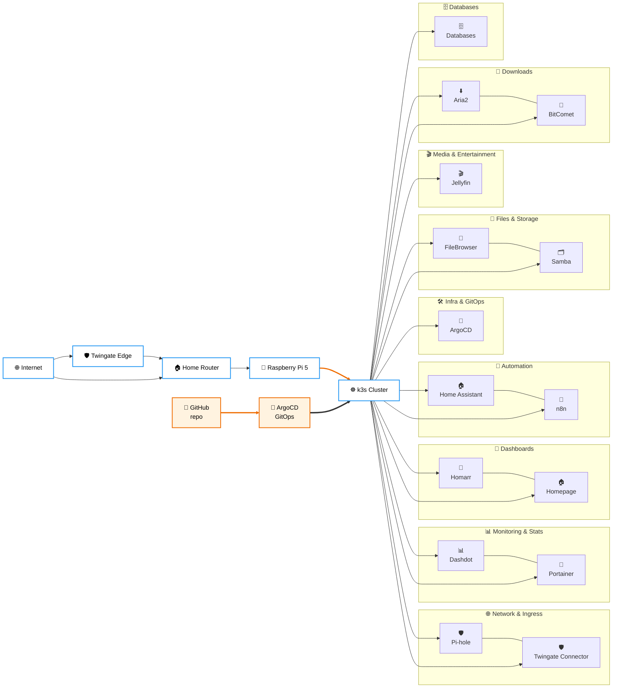

# ☸️ k3s — Production Stack

[](https://k3s.io/)
[](https://argo-cd.readthedocs.io/)
[](https://traefik.io/)
[](https://github.com/bitnami-labs/sealed-secrets)

> **The production half of Home Server Lab — a single-node k3s cluster on any Linux server, fully driven by GitOps via ArgoCD, with sealed secrets in git and Traefik ingress on a private domain.**

This directory holds every Kubernetes manifest the cluster runs. After bootstrap, `git push` is the only deployment mechanism — ArgoCD reconciles the rest.

---

## 🎯 **Design Principles**

- **GitOps Everything**: Every workload, secret, ingress and config lives in this repo. The cluster is reproducible from a single `git clone`.
- **Secrets Stay in Git**: SealedSecrets means even credentials are committed safely — only the cluster's private key can decrypt them.
- **One Server, Real Workloads**: Designed for a single homelab server, no separate control plane node, no cloud dependencies.
- **Convention Over Configuration**: Every app follows the same `setup.sh` + `*.yaml` pattern, generated from a shared scaffold.
- **Self-Documenting**: Each app's `README.md` carries YAML frontmatter that drives this very page.

---

## 📁 **Repository Layout**

```
k3s/
├── base/
│   └── namespaces/         # Namespace + label definitions
├── infra/                  # Cluster-wide infrastructure
│   ├── traefik/                # Ingress controller + dashboard
│   ├── sealed-secrets/         # SealedSecret controller
│   ├── cert-manager/           # ACME / TLS certificates
│   └── argocd/                 # GitOps controller
├── apps/                   # Workload manifests (auto-discovered below)
│   └── <service>/
│       ├── README.md           # Frontmatter drives the table below
│       ├── setup.sh            # Sourced shell wrapper around _app-ctl.sh
│       ├── deployment.yaml
│       ├── service.yaml
│       ├── ingress.yaml        # optional
│       ├── configmap.yaml      # optional
│       ├── sealedsecret.yaml   # optional
│       ├── pvc.yaml            # optional
│       └── rbac.yaml           # optional
└── scripts/                # Shared helpers
    ├── _app-ctl.sh             # Common deploy/status/logs/exec runner
    ├── new-service.sh          # Scaffold a new app
    ├── seal.sh                 # Encrypt a Secret → SealedSecret
    ├── db-user.sh              # Provision DB user + sealed creds
    ├── pi-observe.sh           # Host-level observability helper
    └── cluster-restore.sh      # Disaster recovery runbook
```

---

<!-- AUTOGEN:CATEGORIES:START -->
## 🏷️ **Service Categories**

| Category | Description | Services |
|----------|-------------|----------|
| 🛠️ Infra & GitOps | Cluster control plane, GitOps, secrets | ArgoCD |
| 🌐 Network & Ingress | DNS, VPN, ingress and remote access | Pi-hole, Twingate Connector |
| 📊 Monitoring & Stats | Cluster + host observability | Dashdot, Portainer |
| 🏡 Dashboards | Landing pages and service catalogs | Homarr, Homepage |
| 🤖 Automation | Workflow and smart-home automation | Home Assistant, n8n |
| 🎬 Media & Entertainment | Streaming and media servers | Jellyfin |
| 📁 Files & Storage | Persistent file storage and sharing | FileBrowser, Samba |
| 🧲 Downloads | Torrents, downloaders and grabbers | Aria2, BitComet |
| 🗄️ Databases | Stateful data stores | Databases |
<!-- AUTOGEN:CATEGORIES:END -->

## 🏗️ **Cluster Architecture**

<!-- AUTOGEN:DIAGRAM:START -->
> **📝 Note:** This diagram is auto-generated from service metadata.


<!-- AUTOGEN:DIAGRAM:END -->

---

## 🚀 **Available Services**

<!-- AUTOGEN:SERVICES:START -->
> **📝 Note:** This section is auto-generated from each `k3s/apps/<svc>/README.md` frontmatter. Edit those files; this section regenerates on push.

### 🛠️ Infra & GitOps

| Service | Namespace | Port | Domain | Components |
|---------|-----------|------|--------|------------|
| [**🚀 ArgoCD**](./apps/argocd/) | `argocd` | `—` | `argocd.home.ijlalahmad.dev` | `deployment`, `statefulset`, `service`, `ingress` |

### 🌐 Network & Ingress

| Service | Namespace | Port | Domain | Components |
|---------|-----------|------|--------|------------|
| [**🛡️ Pi-hole**](./apps/pihole/) | `dashboard-network` | `8110` | `pihole.home.ijlalahmad.dev` | `deployment`, `service`, `ingress`, `configmap`, `sealedsecret`, `pvc` |
| [**🛡️ Twingate Connector**](./apps/twingate/) | `dashboard-network` | `—` | `—` | `deployment`, `sealedsecret` |

### 📊 Monitoring & Stats

| Service | Namespace | Port | Domain | Components |
|---------|-----------|------|--------|------------|
| [**📊 Dashdot**](./apps/dashdot/) | `monitoring` | `8120` | `dashdot.home.ijlalahmad.dev` | `deployment`, `service`, `ingress` |
| [**🐳 Portainer**](./apps/portainer/) | `monitoring` | `8500` | `portainer.home.ijlalahmad.dev` | `deployment`, `service`, `ingress`, `rbac`, `pvc` |

### 🏡 Dashboards

| Service | Namespace | Port | Domain | Components |
|---------|-----------|------|--------|------------|
| [**🏡 Homarr**](./apps/homarr/) | `dashboard-network` | `8100` | `homarr.home.ijlalahmad.dev` | `deployment`, `service`, `ingress`, `sealedsecret`, `pvc` |
| [**🏠 Homepage**](./apps/homepage/) | `dashboard-network` | `8800` | `homepage.home.ijlalahmad.dev` | `deployment`, `service`, `ingress`, `configmap`, `sealedsecret`, `rbac` |

### 🤖 Automation

| Service | Namespace | Port | Domain | Components |
|---------|-----------|------|--------|------------|
| [**🏠 Home Assistant**](./apps/home-assistant/) | `automation` | `8123` | `ha.home.ijlalahmad.dev` | `deployment`, `service`, `ingress`, `configmap`, `pvc` |
| [**🔄 n8n**](./apps/n8n/) | `automation` | `8400` | `n8n.home.ijlalahmad.dev` | `deployment`, `service`, `ingress`, `sealedsecret`, `pvc` |

### 🎬 Media & Entertainment

| Service | Namespace | Port | Domain | Components |
|---------|-----------|------|--------|------------|
| [**🎬 Jellyfin**](./apps/jellyfin/) | `media` | `8200` | `jellyfin.home.ijlalahmad.dev` | `deployment`, `service`, `ingress`, `pvc` |

### 📁 Files & Storage

| Service | Namespace | Port | Domain | Components |
|---------|-----------|------|--------|------------|
| [**📂 FileBrowser**](./apps/filebrowser/) | `file-management` | `8300` | `files.home.ijlalahmad.dev` | `deployment`, `service`, `ingress`, `pvc` |
| [**🗂️ Samba**](./apps/samba/) | `file-management` | `445` | `—` | `deployment`, `service`, `configmap`, `sealedsecret`, `pvc` |

### 🧲 Downloads

| Service | Namespace | Port | Domain | Components |
|---------|-----------|------|--------|------------|
| [**⬇️ Aria2**](./apps/aria2/) | `downloads` | `8080` | `aria2.home.ijlalahmad.dev` | `deployment`, `service`, `ingress`, `pvc` |
| [**🧲 BitComet**](./apps/bitcomet/) | `dashboard-network` | `8700` | `bitcomet.home.ijlalahmad.dev` | `deployment`, `service`, `ingress`, `sealedsecret`, `pvc` |

### 🗄️ Databases

| Service | Namespace | Port | Domain | Components |
|---------|-----------|------|--------|------------|
| [**🗄️ Databases**](./databases/) | `databases` | `—` | `—` | `statefulset`, `service`, `sealedsecret`, `pvc` |
<!-- AUTOGEN:SERVICES:END -->

---

## ⚙️ **Per-App Workflow**

Every app exposes the same operator-friendly CLI through its `setup.sh`:

```bash
cd k3s/apps/<svc>

./setup.sh deploy       # apply all manifests in the right order
./setup.sh status       # pods, services, ingress, PVCs, recent events
./setup.sh logs         # follow container logs
./setup.sh exec         # drop into a shell inside the pod
./setup.sh restart      # rollout-restart the deployment
./setup.sh undeploy     # delete all manifests for this app
```

Under the hood every `setup.sh` is a thin wrapper that sources [`scripts/_app-ctl.sh`](./scripts/_app-ctl.sh) with a few variables (`APP`, `NAMESPACE`, `EXTERNAL_PORT`, `DOMAIN`, plus `HAS_PVC` / `HAS_SECRET` / `HAS_INGRESS` / `HAS_CONFIGMAP` / `HAS_RBAC` flags).

---

## 🔐 **Secrets Workflow**

```bash
# 1. Create a normal Secret locally (NEVER commit)
kubectl create secret generic my-app-secret \
  --namespace my-app \
  --from-literal=API_TOKEN=hunter2 \
  --dry-run=client -o yaml > /tmp/secret.yaml

# 2. Seal it for this cluster
./scripts/seal.sh /tmp/secret.yaml > apps/my-app/sealedsecret.yaml

# 3. Commit the SealedSecret — safe to push
git add apps/my-app/sealedsecret.yaml && git commit -m "secret: my-app token"
```

The in-cluster controller decrypts SealedSecrets back into native `Secret`s on apply.

---

## 🛰️ **Bootstrap Order**

When rebuilding from scratch:

1. **k3s install** — `curl -sfL https://get.k3s.io | sh -`
2. **Namespaces** — `kubectl apply -f base/namespaces/`
3. **Sealed Secrets controller** — `kubectl apply -k infra/sealed-secrets/`
4. **Traefik** — `kubectl apply -k infra/traefik/` (provides the ingress class)
5. **cert-manager** — `kubectl apply -k infra/cert-manager/`
6. **Pi-hole** — DNS must come up before LAN clients can resolve `*.lan` and `*.home.ijlalahmad.dev`
7. **ArgoCD** — `kubectl apply -k infra/argocd/` then bootstrap the root `Application` pointing at `apps/`
8. **Everything else** — ArgoCD takes over and syncs the remaining `apps/*`

---

## 🆕 **Adding a New Service**

```bash
./scripts/new-service.sh my-app
# → scaffolds k3s/apps/my-app/{setup.sh,deployment.yaml,service.yaml,...}
```

Then:

1. Fill in the manifest stubs.
2. Add a `README.md` with the frontmatter schema (see any existing app).
3. `git push` — the GitHub Action regenerates this page and ArgoCD deploys the workload.

> ✨ Frontmatter fields used by the generator: `name`, `category`, `purpose`, `description`, `icon`, `namespace`, `external_port`, `domain`, `components[]`, `features[]`, `resource_usage`.

---

## 🔗 **See Also**

- **[Root README](../README.md)** — homelab overview & dual-stack rationale
- **[Docker stack](../docker/README.md)** — the Compose-based variant used for prototyping
- **[Contributing](../CONTRIBUTING.md)** — how to propose changes
